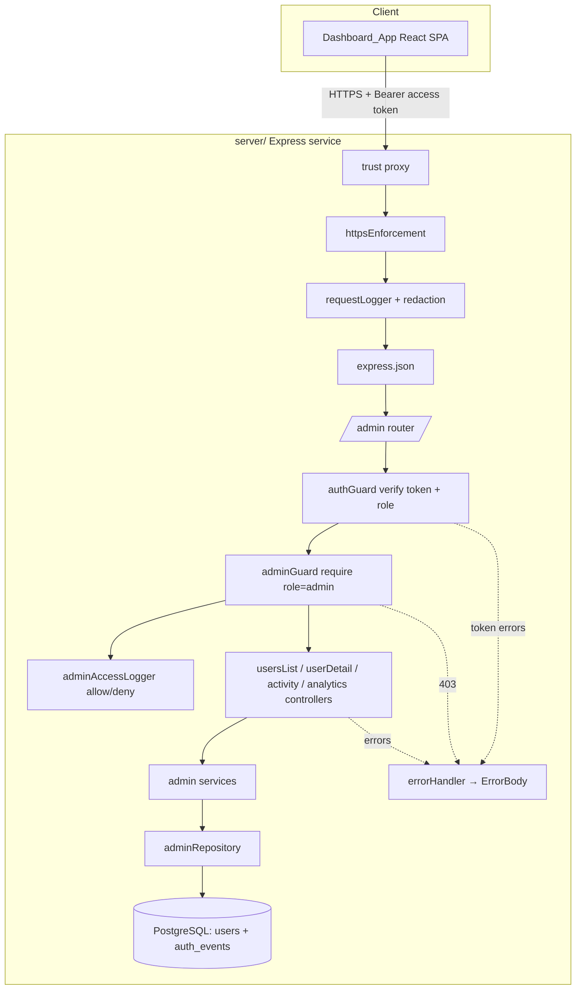
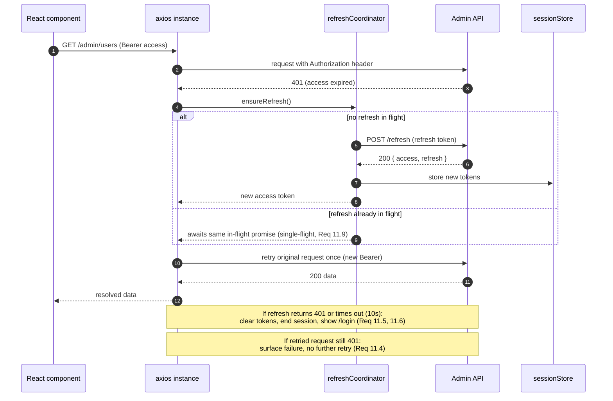

# Design Document

## Overview

This feature adds administrative capabilities on top of the existing authentication
foundation. It is delivered as **two coordinated deliverables**:

- **Deliverable A — Backend admin API (extends `server/`).** New routes, controllers,
  services, and a repository are layered into the existing Node.js + Express + TypeScript
  service. They introduce a `role` model on `users`, role-based authorization, and a set of
  read-focused admin endpoints (user listing/search, user detail + activity, activity log,
  analytics aggregates). These additions **reuse** the existing JWT access/refresh token
  mechanism, the `ErrorBody` taxonomy, pino request logging with redaction, rate limiting,
  the config loader, and the Knex/PostgreSQL data layer. No new backend service is created.

- **Deliverable B — Admin dashboard web app (new `admin-dashboard/`).** A standalone Vite +
  React + TypeScript single-page app at the repository root. It authenticates an
  administrator, then provides analytics, user browsing/search, user detail, and an activity
  log — all over HTTPS against the backend admin API.

### Why extend the existing service rather than build a new backend

The admin API needs exactly what the existing service already provides: JWT verification, the
`argon2id`-backed `users` table, the append-only `auth_events` audit trail, the structured
`ErrorBody` shape, per-IP rate limiting, HTTPS enforcement, and pino logging with secret
redaction. Standing up a separate service would duplicate all of this and force cross-service
token verification and schema sharing. Adding the admin API as new layers **inside** `server/`
keeps a single source of truth for tokens and data, reuses the tested middleware pipeline, and
matches the existing `routes → controllers → services → repositories` architecture. The tradeoff
— admin and end-user endpoints share one deployable — is acceptable because both already share
the same auth domain, and authorization is enforced per-route by an `adminGuard`.

### Key technology decisions and rationale

**Backend (reused, already in `server/package.json`):**

- **Express 4** + **TypeScript (strict)** — matches the existing service; admin routes mount
  into the same `createApp` pipeline.
- **Knex 3 + `pg`** — the admin repository uses the same query-builder and migration tooling
  (`migrate`/`rollback` npm scripts, `.ts` migrations under `src/db/migrations`).
- **`jsonwebtoken` (HS256)** — the `role` claim is added to the existing access-token issuance;
  verification stays centralized in `tokenManager`.
- **`zod`** — admin query-parameter validation reuses the existing `ValidationResult`/`FieldError`
  pattern from `src/validation`.
- **Jest + supertest + fast-check** — the admin API is tested with the same stack, including
  property-based tests against a real test database (`DATABASE_URL_TEST`).

**Frontend (new, added to `admin-dashboard/package.json`):**

- **Vite + React 18 + TypeScript** — fast dev/build tooling and a component model that suits the
  dashboard's view/route structure. ([Vite](https://vite.dev/), [React](https://react.dev/))
- **TanStack React Query v5** — declarative server-state management giving loading/empty/error
  states, request cancellation, deduplication, and retry controls that map directly onto the
  frontend requirements (Req 12–15). ([TanStack Query](https://tanstack.com/query/latest))
- **React Router v6** — client-side routing with a protected-route wrapper and preserved
  originally-requested location (Req 16). ([React Router](https://reactrouter.com/))
- **Axios** — a single HTTP client instance carries the auth interceptor implementing
  attach-access-token → 401 → refresh → retry-once with single-flight refresh (Req 11).
  Axios interceptors and per-request cancellation make this behavior cohesive to implement.
  ([Axios](https://axios-http.com/))
- **Recharts** — declarative React charting for the per-day analytics series (Req 15.4).
  ([Recharts](https://recharts.org/))
- **Vitest + React Testing Library** — component/hook tests with a mocked API client; the pure
  interceptor logic is additionally property-tested with **fast-check**.
  ([Vitest](https://vitest.dev/), [React Testing Library](https://testing-library.com/))

_Library capabilities above were summarized from their official documentation; content was
rephrased for compliance with licensing restrictions._

### Requirements coverage map

- Backend Req 1 (role model) → Migration + `set-role` CLI + registration default.
- Backend Req 2 (role claim) → `tokenManager.issueAccessToken` extension + login/refresh issuance.
- Backend Req 3 (authorization) → `adminGuard` middleware.
- Backend Req 4–7 (users list/detail/activity/analytics) → admin routes/controllers/services + `adminRepository`.
- Backend Req 8–9 (response security + audit) → response DTO mapping, HTTPS reuse, admin access audit logger.
- Frontend Req 10–16 → React app: login, session/interceptor, users list, user detail, activity log, analytics, unauthorized-access handling.

## Architecture

### Backend additions layered into `server/`

The admin API follows the existing layering exactly. New files are added alongside their
existing siblings; no existing layer's responsibilities change (other than the two explicit
extensions: the `role` column and the `role` claim).

```
server/src/
  db/migrations/
    20250101000004_add_role_to_users.ts     (NEW) role column + CHECK + backfill
  scripts/
    setRole.ts                               (NEW) operator CLI: npm run set-role
  security/
    tokenManager.ts                          (EXTEND) role claim in access token
  middleware/
    adminGuard.ts                            (NEW) role-claim authorization (403/401)
    authGuard.ts                             (EXTEND) expose verified role on req
  routes/
    admin.ts                                 (NEW) mounts /admin/* behind authGuard+adminGuard
  controllers/
    admin/usersListController.ts             (NEW) GET /admin/users
    admin/userDetailController.ts            (NEW) GET /admin/users/:id
    admin/activityController.ts              (NEW) GET /admin/activity
    admin/analyticsController.ts             (NEW) GET /admin/analytics
  services/
    adminUsersService.ts                     (NEW) list/search/detail orchestration
    adminActivityService.ts                  (NEW) activity-log filtering/pagination
    adminAnalyticsService.ts                 (NEW) aggregate computation
    adminAccessLogger.ts                     (NEW) admin access audit (allow + 403)
  repositories/
    adminRepository.ts                       (NEW) aggregation/filter/paginate queries
  validation/
    adminQuery.ts                            (NEW) zod parsing of pagination/filter params
```

The existing `createApp` pipeline is unchanged in ordering; a single line mounts the admin
router: `app.use('/admin', adminRouter)`. HTTPS enforcement, request logging with redaction,
and body parsing already run ahead of it (Req 8.2, 8.3).



### Frontend app structure

```
admin-dashboard/
  index.html
  vite.config.ts
  package.json
  src/
    main.tsx                      app bootstrap: QueryClientProvider + RouterProvider
    api/
      client.ts                   axios instance + auth interceptor (attach/refresh/retry)
      refreshCoordinator.ts       single-flight refresh (pure, property-tested)
      endpoints.ts                typed calls: login, refresh, logout, users, activity, analytics
      types.ts                    shared DTO types mirroring backend contracts
    auth/
      sessionStore.ts             in-memory token store + subscribe (Req 11.1)
      SessionProvider.tsx         React context exposing session + login/logout
      ProtectedRoute.tsx          redirects to /login, preserves requested location (Req 16)
    hooks/
      useUsers.ts                 React Query: users list (search + pagination)
      useUserDetail.ts            React Query: user detail + activity
      useActivity.ts              React Query (infinite): activity log
      useAnalytics.ts             React Query: analytics aggregates
    pages/
      LoginPage.tsx
      AnalyticsPage.tsx           default landing (Req 10.2, 15)
      UsersListPage.tsx
      UserDetailPage.tsx
      ActivityLogPage.tsx
    components/
      LoadingState.tsx  EmptyState.tsx  ErrorState.tsx  Chart.tsx  Pagination.tsx
    routes.tsx                    route table wrapping protected pages
```

Routing: `/login` is public; `/`, `/users`, `/users/:id`, `/activity`, `/analytics` are wrapped
by `ProtectedRoute`. The default landing after login is `/analytics` (Req 10.2). Unless a
previously-requested protected location was preserved, in which case login redirects there (Req 16.5).



## Components and Interfaces

### Backend

#### 1. Migration — `20250101000004_add_role_to_users.ts` (Req 1.1, 1.2, 1.7)

Adds a `role` column to `users`, constrained to `'user' | 'admin'`, default `'user'`, with a
CHECK constraint. Existing rows are backfilled to `'user'` by the column default (all existing
rows keep their identity and count). `down` drops the column, leaving all other columns
untouched.

```ts
export async function up(knex: Knex): Promise<void> {
  await knex.schema.alterTable('users', (t) => {
    t.text('role').notNullable().defaultTo('user');
  });
  // Portable, explicitly-named CHECK constraint restricting the value set (Req 1.1).
  await knex.raw(
    `alter table "users" add constraint "users_role_check" check ("role" in ('user','admin'))`,
  );
}
export async function down(knex: Knex): Promise<void> {
  await knex.raw(`alter table "users" drop constraint if exists "users_role_check"`);
  await knex.schema.alterTable('users', (t) => t.dropColumn('role'));
}
```

`usersRepository` is extended so `UserRecord` carries `role: Role` (mapped from the `role`
column) and inserts default to `'user'` (registration assigns `user`, Req 1.3). A new
`updateRole(id, role)` function supports the operator CLI (Req 1.5).

```ts
export type Role = 'user' | 'admin';
export interface UserRecord { id: string; email: string; passwordHash: string; role: Role; createdAt: Date; }
// added to usersRepository:
updateRole(id: string, role: Role, trx?: Knex.Transaction): Promise<UserRecord | null>; // null when id not found (Req 1.6)
```

#### 2. Operator CLI — `scripts/setRole.ts` + `set-role` npm script (Req 1.4–1.6)

A Node script invoked as `npm run set-role -- <email> admin`. It resolves the user by email and
calls `usersRepository.updateRole`. It is **not** reachable over HTTP (no route mounts it),
satisfying Req 1.4. On success it prints a confirmation including the updated role (Req 1.5); on
an unknown email it exits non-zero and prints a not-found error, changing nothing (Req 1.6).

```jsonc
// server/package.json scripts (added)
"set-role": "ts-node src/scripts/setRole.ts"
```

```ts
// setRole.ts (shape)
async function main(email: string, role: Role): Promise<void> {
  const user = await usersRepository.findByEmail(email.trim().toLowerCase());
  if (user === null) { console.error(`No user found for ${email}`); process.exitCode = 1; return; }
  const updated = await usersRepository.updateRole(user.id, role);
  console.log(`Updated ${updated!.email} → role=${updated!.role}`);
}
```

#### 3. Role claim in access token — `tokenManager` extension (Req 2.1–2.5)

`issueAccessToken` gains a `role` parameter and embeds a single `role` claim. Callers that issue
access tokens (login in `authService`, rotation in `tokenManager.rotateRefreshToken`) fetch and
pass the user's current role. When issuing for an account with no role, the claim defaults to
`'user'` (Req 2.2). Verification returns the role to callers; the guard treats an absent or
out-of-set claim as `'user'` (Req 2.5).

```ts
// tokenManager.ts (extended surface)
issueAccessToken(userId: string, role: Role): string;   // adds `role` claim (Req 2.1, 2.2)

export type AccessTokenVerification =
  | { status: 'accepted'; userId: string; role: Role }   // role normalized to 'user' if absent/invalid (Req 2.5)
  | { status: 'missing' } | { status: 'invalid' }
  | { status: 'expired' } | { status: 'malformed' };
```

Rotation must issue the access token with the owner's role, so `rotateWithin` looks up the
user's role (via `usersRepository.findById`) before minting the access token.

#### 4. Auth guard extension + `adminGuard` (Req 2.3, 2.4, 3.1–3.6)

`authGuard` continues to classify the token and, on `accepted`, additionally attaches the
verified role: `req.userId` and `req.userRole` are set together. A failed verification attaches
neither (Req 2.4). `adminGuard` runs **after** `authGuard` and enforces the admin role:

```ts
// middleware/adminGuard.ts
export function createAdminGuard(deps?: { accessLogger?: AdminAccessLogger }): RequestHandler {
  return (req, _res, next) => {
    // authGuard already ran: a rejected token produced a 401 before we get here (Req 3.2, 3.5).
    if (req.userRole === 'admin') {
      deps?.accessLogger?.recordAllowed(req);   // Req 9.1 (non-blocking)
      next();
      return;
    }
    deps?.accessLogger?.recordDenied(req);       // Req 9.2 (non-blocking)
    next(new ForbiddenError());                  // 403, admin privileges required (Req 3.3, 3.4)
  };
}
```

A new `ForbiddenError` subclass is added to the errors taxonomy (403, code `admin_required`).
Because `authGuard` runs first, missing/invalid/expired/malformed tokens already yield 401 with
no admin data (Req 3.2, 3.5, 3.6); `adminGuard` only ever distinguishes `admin` from non-admin,
returning 403 for a valid non-admin token (Req 3.3, 3.4).

The 1000 ms authorization-decision bound (Req 3.1) is met trivially: the decision is an
in-memory claim comparison with no I/O.

#### 5. Admin routes — `routes/admin.ts` (all endpoints behind `authGuard` + `adminGuard`)

```ts
const adminRouter = Router();
adminRouter.use(authGuard);         // 401 on bad/missing token (Req 3.2, 3.5)
adminRouter.use(createAdminGuard({ accessLogger: adminAccessLogger })); // 403 on non-admin (Req 3.3)
adminRouter.get('/users', usersListController);
adminRouter.get('/users/:id', userDetailController);
adminRouter.get('/activity', activityController);
adminRouter.get('/analytics', analyticsController);
```

#### 6. Endpoint contracts

| Method & Path | Query / Params | Success | Error cases |
|---|---|---|---|
| `GET /admin/users` | `search?` (1–254 after trim), `page?` (1-based, default 1), `pageSize?` (default 25, max 100) | `200` `UserListResponse` | `400` invalid `search`/pagination (Req 4.4, 4.10); `401`/`403` auth |
| `GET /admin/users/:id` | `:id` UUID; `activityPage?`, `activityPageSize?` (default 20, max 100) | `200` `UserDetailResponse` | `400` malformed id (Req 5.5); `404` not found (Req 5.6); `401`/`403` |
| `GET /admin/activity` | `eventType?` ∈ {registration, login-success, login-failure, logout}; `start?`,`end?` ISO-8601 UTC; `page?`; `pageSize?` (default 25, max 100) | `200` `ActivityLogResponse` | `400` bad `eventType`/range (Req 6.6, 6.7); `401`/`403` |
| `GET /admin/analytics` | `start?`,`end?` ISO-8601 UTC (default last 30 days, max span 366d); `interval?` = `day` | `200` `AnalyticsResponse` | `400` bad range/span/interval (Req 7.7–7.9); `401`/`403` |

Controllers are thin: parse+validate query via `validation/adminQuery.ts`, call the service,
map the result to the response DTO (excluding all secrets), and forward errors to the
centralized handler. All list endpoints order most-recent-first with deterministic tie-breaks
(Req 4.1, 5.2, 6.1).

#### 7. Admin services

- **`adminUsersService`** — `listUsers({ search, page, pageSize })` clamps `pageSize` to
  `[1,100]` (default 25), computes offset from the 1-based page, delegates the filtered/paged
  query and a total-count query to `adminRepository`, and returns rows + pagination metadata
  (Req 4). `getUserDetail({ id, activityPage, activityPageSize })` returns the user summary plus
  a page of that user's auth events (default 20, max 100), or a not-found signal (Req 5).
- **`adminActivityService`** — `listActivity({ eventType, start, end, page, pageSize })` validates
  the range (start ≤ end), clamps `pageSize` to `[1,100]` (default 25), and returns filtered,
  paged, ordered events + metadata (Req 6).
- **`adminAnalyticsService`** — `getAnalytics({ start, end, interval })` defaults the range to the
  last 30 days, rejects `start > end` and spans > 366 days and non-`day` intervals, and computes
  totals, success rate, active users, and the per-day series (Req 7).

```ts
export interface AdminAnalyticsService {
  getAnalytics(input: AnalyticsQuery): Promise<AnalyticsResponse>;
}
// success rate: loginSuccess / (loginSuccess + loginFailure), 0 when denominator 0, rounded 4dp, in [0,1] (Req 7.2, 7.3)
// active users: distinct user_id among login-success events in range (Req 7.4)
```

#### 8. Admin repository — `repositories/adminRepository.ts`

Owns all admin queries against `users` and `auth_events`. Never selects `password_hash` or any
token value (Req 8.1). Functions (all transaction-aware, snake_case→camelCase mapped):

```ts
export interface AdminRepository {
  listUsers(f: { search?: string; limit: number; offset: number }): Promise<UserSummary[]>;
  countUsers(f: { search?: string }): Promise<number>;
  findUserSummaryById(id: string): Promise<UserSummary | null>;
  listUserActivity(f: { userId: string; limit: number; offset: number }): Promise<ActivityEntry[]>;
  listActivity(f: ActivityFilter & { limit: number; offset: number }): Promise<ActivityEntry[]>;
  countActivity(f: ActivityFilter): Promise<number>;
  aggregateTotals(range: TimeRange): Promise<{ registration: number; loginSuccess: number; loginFailure: number }>;
  countActiveUsers(range: TimeRange): Promise<number>;      // distinct user_id in login-success
  aggregatePerDay(range: TimeRange): Promise<DailyBucket[]>; // grouped by UTC day
}
```

Search uses a case-insensitive `ILIKE '%term%'` on `email` (Req 4.2). Ordering is
`created_at DESC, id ASC` for users (Req 4.1) and `occurred_at DESC, id DESC` for activity
(Req 6.1). Per-day grouping uses `date_trunc('day', occurred_at at time zone 'UTC')`.

#### 9. Admin access audit logger — `services/adminAccessLogger.ts` (Req 9.1–9.4)

Records an entry for every allowed admin request and every 403 rejection, containing the
requester's user id, endpoint path, HTTP method, and an ISO-8601 UTC millisecond timestamp. It
never logs secrets (Req 9.3) and is **non-blocking**: a logging failure never alters or delays
the originating response (Req 9.4). It reuses the same non-blocking/retry philosophy as the
existing `auditLogger` and writes via pino (the request logger's redaction already strips
tokens/passwords, Req 8.3). It does not persist to `auth_events` (those are authentication
events, not admin-access events); it emits structured log entries.

### Frontend

#### 1. API client + auth interceptor — `api/client.ts` + `api/refreshCoordinator.ts` (Req 11, 16.3, 16.4, 16.6)

A single axios instance has a `baseURL` beginning with `https://` (Req 16.3). A request
interceptor rejects any resolved request URL whose scheme is not `https://` before transmission
(Req 16.4) and attaches the current access token in the `Authorization` header — never in the
URL/query (Req 11.2, 16.6). A response interceptor implements refresh-and-retry:

```ts
// On 401 for a non-refresh request that has not yet been retried:
//   token = await refreshCoordinator.ensureRefresh();  // single-flight (Req 11.9)
//   if (token) retry original request once with new token (Req 11.3);
//   else session already ended (Req 11.5/11.6)
// On 401 for an already-retried request: reject, surface to view (Req 11.4)
// On 403: reject with an "admin privileges required" marker, no retry (Req 11.8)
```

`refreshCoordinator` holds an in-flight refresh promise so concurrent 401s await the same
refresh (single-flight, Req 11.9). The refresh call has a 10-second timeout; a 401, timeout, or
network error ends the session, clears tokens, and routes to `/login` (Req 11.5, 11.6). This
coordinator's decision logic is a pure module and is the primary target of frontend
property-based tests.

```ts
export interface RefreshCoordinator {
  ensureRefresh(): Promise<string | null>; // resolves new access token, or null when session ended
}
```

#### 2. Session store — `auth/sessionStore.ts` + `SessionProvider.tsx` (Req 11.1, 11.7, 16)

Tokens are held **in memory** (module-scoped store) rather than `localStorage`. Rationale: an
in-memory store is not readable by injected scripts across reloads and minimizes XSS token-theft
exposure; the tradeoff is that a full page reload requires re-login, which is acceptable for an
internal admin tool and consistent with the short 15-minute access token plus refresh-on-401
flow. The store exposes exactly one current access token and one current refresh token (Req 11.1),
with `setSession`, `clearSession`, `getAccessToken`, and a subscribe mechanism for the provider.
On login the app reads the returned role (decoding the access token's `role` claim / using the
login response) and only establishes a session when the role is `admin` (Req 10.2, 10.3). Logout
calls `POST /logout`, clears tokens, and shows `/login` (Req 11.7).

#### 3. Protected route — `auth/ProtectedRoute.tsx` (Req 16.1, 16.2, 16.5)

Wraps every administrative route. When no session exists it renders a redirect to `/login` and
stashes the originally-requested location (React Router `state.from`); after a successful login
the app navigates to that preserved location, or to `/analytics` when none was stored (Req 16.5).

#### 4. React Query hooks

- `useUsers({ search, page })` — queries `GET /admin/users` with `pageSize=25`; search input is
  debounced 400 ms (Req 12.3) and stale responses are discarded by React Query's query keys +
  cancellation (Req 12.4). Exposes loading/empty/error and a `retry` (Req 12.6–12.9).
- `useUserDetail(id)` — queries `GET /admin/users/:id` with a 30 s timeout; distinguishes 404 vs
  401/403 vs other errors for the view (Req 13).
- `useActivity(filters)` — `useInfiniteQuery` over `GET /admin/activity` (`pageSize=50`),
  appending pages in descending order (Req 14.1, 14.8); prevents concurrent requests while one is
  in-flight (Req 14.4).
- `useAnalytics(range)` — queries `GET /admin/analytics`; default range last 30 days (Req 15.3);
  derives the displayed success-rate percentage (1 dp, `0.0%` when denominator 0, Req 15.2) and
  feeds the per-day series to the chart (Req 15.4).

#### 5. Pages and shared state components

`LoginPage` performs client-side field validation (non-empty email/password; email pattern with
exactly one `@`, non-empty local part, and a `.` in the domain) before sending, applies a 30 s
timeout, blocks double submit, and maps 200-admin / 200-user / 401 / other outcomes to the
behaviors in Req 10. `AnalyticsPage` (default landing), `UsersListPage`, `UserDetailPage`, and
`ActivityLogPage` each render `LoadingState` / `EmptyState` / `ErrorState` (with retry) driven by
their hook's status, per Req 12–15.

## Data Models

### Role column (backend)

`users.role TEXT NOT NULL DEFAULT 'user' CHECK (role IN ('user','admin'))`. Represented in TS as
`type Role = 'user' | 'admin'` and surfaced on `UserRecord.role`.

### Response DTOs (shared shape between backend responses and frontend `api/types.ts`)

```ts
// A single 1-based page's metadata (Req 4.6, 6.5)
interface PaginationMeta {
  page: number;        // 1-based page indicator echoed back
  pageSize: number;    // effective page size after clamping
  total: number;       // total count of records matching the request
}

// User summary — NO password hash, NO tokens (Req 4.5, 8.1)
interface UserSummary {
  id: string;
  email: string;
  role: Role;
  createdAt: string;   // ISO-8601 UTC
}

interface UserListResponse {
  users: UserSummary[];
  pagination: PaginationMeta;
}

// One authentication event (Req 6.2)
interface ActivityEntry {
  id: string;
  eventType: 'registration' | 'login-success' | 'login-failure' | 'logout';
  userId: string | null;
  email: string | null;
  sourceIp: string | null;
  occurredAt: string;  // ISO-8601 UTC
}

// User detail + recent activity (Req 5.1–5.4) — NO password hash, NO refresh tokens
interface UserDetailResponse {
  id: string;
  email: string;
  role: Role;
  createdAt: string;   // ISO-8601 UTC
  activity: ActivityEntry[];      // most-recent-first, default 20 / max 100
  activityPagination: PaginationMeta;
}

interface ActivityLogResponse {
  events: ActivityEntry[];
  pagination: PaginationMeta;
}

// Analytics (Req 7)
interface DailyBucket {
  intervalStart: string;   // ISO-8601 UTC start of the 24h interval
  registration: number;
  loginSuccess: number;
  loginFailure: number;
}
interface AnalyticsResponse {
  range: { start: string; end: string };   // ISO-8601 UTC
  registration: number;        // ≥ 0
  loginSuccess: number;        // ≥ 0
  loginFailure: number;        // ≥ 0
  loginSuccessRate: number;    // in [0,1], 4 dp; 0 when denominator 0 (Req 7.2, 7.3)
  activeUsers: number;         // distinct login-success user ids, ≥ 0 (Req 7.4)
  series: DailyBucket[];       // per-day (Req 7.5)
}
```

Error responses reuse the existing `ErrorBody` shape `{ error: { code, message, fields? } }`
(Req 8.4).

## Correctness Properties

_A property is a characteristic or behavior that should hold true across all valid executions of
a system — essentially, a formal statement about what the system should do. Properties serve as
the bridge between human-readable specifications and machine-verifiable correctness guarantees._

The properties below were derived from the acceptance-criteria prework. Redundant criteria were
consolidated: all pagination clamping/default/out-of-range/total rules collapse into one
pagination invariant; the three list-ordering rules into one ordering property; all
secret-exclusion rules into one deep-exclusion property; the authorization-decision rules into
one role-decision property; and the frontend transport rules into one transport-safety property.

**Backend properties (Properties 1–19).**

### Property 1: Registration assigns the default role

_For any_ valid registration input, the created User_Account has role exactly `user`.

**Validates: Requirements 1.3**

### Property 2: Role update persists and is reported

_For any_ existing User_Account, invoking the operator role update to `admin` results in a
re-read of that account showing role `admin`, and the operation returns a confirmation reporting
role `admin`.

**Validates: Requirements 1.5**

### Property 3: Access-token role round-trip

_For any_ user id and _for any_ role in `{user, admin}`, verifying the access token issued for
that id and role yields an accepted verification whose role equals the issued role and is one of
the two defined values.

**Validates: Requirements 2.1, 2.3**

### Property 4: Role-claim normalization to `user`

_For any_ verified access token whose role claim is absent or is a string not in `{user, admin}`,
the authorization middleware observes role `user` and never `admin`.

**Validates: Requirements 2.2, 2.5**

### Property 5: Role-based authorization decision

_For any_ valid, unexpired access token, `adminGuard` allows the request (calls the next handler
with no error) if and only if the token's normalized role is exactly `admin`; a normalized role
of `user` yields a `403` `ForbiddenError`.

**Validates: Requirements 3.1, 3.3, 3.4**

### Property 6: Rejected requests expose no administrative data

_For any_ request to an admin endpoint that is not authorized (missing, invalid, expired, or
malformed token, or non-admin role), the response body conforms to the `ErrorBody` shape and
contains no user, activity, or analytics records.

**Validates: Requirements 3.6, 6.11, 8.1**

### Property 7: List ordering is deterministic

_For any_ set of records returned by a list endpoint, the records are ordered by the endpoint's
primary key descending with ties broken by the endpoint's secondary key — `(createdAt desc, id
asc)` for users and `(occurredAt desc, id desc)` for activity (both the user-detail activity and
the activity log).

**Validates: Requirements 4.1, 5.2, 6.1**

### Property 8: Pagination invariants (clamping, defaults, totals, out-of-range)

_For any_ list request to `/admin/users` or `/admin/activity` with any (possibly out-of-range or
oversized) page and page-size inputs, the effective page size equals the requested size clamped
to `[1, 100]` (defaulting to 25 when omitted); the returned record count never exceeds the
effective page size; `pagination.total` equals the true count of records matching the request;
`pagination.page` echoes the requested 1-based page; and a page beyond the last returns zero
records with correct metadata.

**Validates: Requirements 4.6, 4.7, 4.8, 4.9, 5.2, 6.5, 6.8, 6.9, 6.10**

### Property 9: User search filter correctness

_For any_ set of users and _for any_ search term of 1–254 characters after trimming, every
returned user summary has an email that contains the term case-insensitively, and the reported
total equals the number of stored users whose email contains the term case-insensitively.

**Validates: Requirements 4.2**

### Property 10: Activity event-type filter correctness

_For any_ set of auth events and _for any_ valid event-type filter, every returned event has that
type and the reported total equals the number of stored events of that type (subject to any
time-range also applied).

**Validates: Requirements 6.3**

### Property 11: Activity time-range filter correctness

_For any_ set of auth events and _for any_ time range with start ≤ end, every returned event has
an occurrence timestamp within `[start, end]` inclusive, no in-range event is omitted from the
total, and no out-of-range event is included.

**Validates: Requirements 6.4**

### Property 12: Secret exclusion in responses and access logs

_For any_ admin response body or admin-access log entry, a deep traversal finds no password-hash
value, no access-token value, and no refresh-token value at any depth (no `password_hash`,
`passwordHash`, access-token, or refresh-token keys or values appear).

**Validates: Requirements 4.5, 5.4, 8.1, 9.3**

### Property 13: Analytics counts match the range

_For any_ set of auth events and _for any_ valid range, the analytics registration,
login-success, and login-failure counts each equal the number of stored events of that type with
occurrence timestamp within the range, and each count is a non-negative integer.

**Validates: Requirements 7.1**

### Property 14: Login success rate is a bounded, correctly-rounded ratio

_For any_ non-negative success and failure counts, the reported login success rate lies in the
inclusive interval `[0, 1]`, equals `success / (success + failure)` rounded to 4 decimal places
when the denominator is positive, and equals exactly `0` when the denominator is zero.

**Validates: Requirements 7.2, 7.3**

### Property 15: Active users equals distinct login-success user ids

_For any_ set of auth events and _for any_ valid range, the reported active-user count equals the
number of distinct non-null user ids appearing in login-success events within the range, and is a
non-negative integer.

**Validates: Requirements 7.4**

### Property 16: Per-day buckets partition the totals

_For any_ set of auth events and _for any_ valid range grouped by day, each daily bucket's
interval start is a UTC day boundary within the range, and summing each event-type count across
all buckets equals the corresponding overall total for that type.

**Validates: Requirements 7.5**

### Property 17: Error bodies are well-formed

_For any_ admin error response, the body matches the `ErrorBody` shape with a non-empty
machine-readable `code` of 1–64 characters and a non-empty human-readable `message` of 1–500
characters.

**Validates: Requirements 8.4**

### Property 18: Admin-access log entries are complete

_For any_ allowed admin request or `403` rejection, the recorded admin-access log entry contains
the requester's User_Account id, the requested endpoint path, the HTTP method, and an ISO-8601
UTC timestamp with at least millisecond precision.

**Validates: Requirements 9.1, 9.2**

### Property 19: Audit logging is non-blocking

_For any_ admin request whose access-logging write fails, the originating request or rejection
completes with the same HTTP status and response body it would have produced with logging
succeeding.

**Validates: Requirements 9.4**

**Frontend properties (Properties 20–27).**

### Property 20: Login email/field validation gates the request

_For any_ login form input that has an empty email, an empty password, or an email not matching
the pattern `local-part@domain` (exactly one `@`, a non-empty local part, and at least one `.` in
the domain), validation fails, each invalid field is marked, and no authentication request is
issued.

**Validates: Requirements 10.5**

### Property 21: Session stores exactly one token pair

_For any_ access/refresh token pair, after establishing a session the store holds exactly that
one access token and that one refresh token.

**Validates: Requirements 11.1**

### Property 22: Transport safety (HTTPS, header-only tokens)

_For any_ admin API request the client issues, the resolved request URL begins with `https://`
and the current access token appears only in the `Authorization` header, never in the URL path or
query string.

**Validates: Requirements 11.2, 16.3, 16.6**

### Property 23: Refresh-and-retry at most once

_For any_ admin request that receives a `401`, the client performs at most one token refresh and
retries the original request at most once; if the retried request again returns `401`, no further
refresh or retry occurs and the failure is surfaced to the view.

**Validates: Requirements 11.3, 11.4**

### Property 24: Single-flight refresh

_For any_ number of concurrent admin requests that receive `401` while a token refresh is already
in progress, exactly one refresh request is made and every waiting request is retried with the
single resulting access token.

**Validates: Requirements 11.9**

### Property 25: No retry on 403

_For any_ admin request that receives a `403`, the client performs no token refresh and no retry
and surfaces an administrator-privileges-required indication.

**Validates: Requirements 11.8**

### Property 26: Success-rate display formatting

_For any_ non-negative success and failure counts, the displayed success rate is a percentage
rounded to one decimal place within `[0.0, 100.0]`, equals `0.0%` when the denominator is zero,
and otherwise equals `success / (success + failure) × 100` rounded to one decimal.

**Validates: Requirements 15.2**

### Property 27: Protected-route redirect and post-login target

_For any_ protected route path, when no session exists the protected-route wrapper redirects to
`/login` while preserving the originally-requested path; upon a successful admin login the app
navigates to that preserved path, or to `/analytics` when none was preserved.

**Validates: Requirements 16.1, 16.5**

## Error Handling

Backend error handling reuses the existing centralized pipeline unchanged:

- **Typed errors → `ErrorBody`.** Admin controllers and services throw the existing `AppError`
  subclasses (`ValidationError` → 400, `NotFoundError` → 404, `TokenError` → 401) plus the new
  `ForbiddenError` → 403 (`admin_required`). The single `createErrorHandler` at the end of the
  pipeline renders them via `toErrorBody`, guaranteeing the `{ error: { code, message, fields? } }`
  shape and bounded code/message lengths (Req 8.4, Property 17).
- **Query validation.** `validation/adminQuery.ts` parses pagination, search, event-type,
  time-range, and interval parameters with zod, returning `ValidationResult` and one `FieldError`
  per invalid parameter (Req 4.4, 4.10, 5.5, 6.6, 6.7, 7.7–7.9). Malformed user ids are validated
  as UUIDs **before** any datastore query (Req 5.5). No validation path mutates stored data.
- **Authorization failures.** `authGuard` maps token failures to 401 (missing/invalid/expired/
  malformed) ahead of `adminGuard`, which maps non-admin roles to 403. Both paths exclude
  administrative data (Property 6). The HTTPS-required rejection is handled by the existing
  `httpsEnforcement` middleware for non-local environments (Req 8.2).
- **Non-blocking audit.** `adminAccessLogger` swallows its own failures so a logging error never
  changes the HTTP status/body or adds delay (Req 9.4, Property 19), mirroring the existing
  `auditLogger` retry/`onFailure` design.
- **Datastore failures.** Unexpected repository/database errors propagate to the centralized
  handler, which collapses unknown errors to a generic 500 without leaking internals.

Frontend error handling maps each transport outcome to a view state:

- **401 →** single-flight refresh + retry-once; on refresh failure/timeout the session ends and
  the app shows `/login` (Req 11.3–11.6).
- **403 →** administrator-privileges-required message, no retry (Req 11.8).
- **404 (user detail) →** not-found message, no detail shown (Req 13.4).
- **Other failures / timeouts →** `ErrorState` with a retry control that re-issues the last
  request using retained filters/search/page (Req 12.8, 12.9, 13.5, 13.7, 14.7, 15.8, 15.9).
- **Empty successful responses →** `EmptyState` (Req 12.7, 13.3, 14.5, 15.7).
- **Non-`https://` URL construction →** the request is cancelled before transmission and a
  secure-connection error is shown, retaining the current view (Req 16.4).

## Testing Strategy

This feature is well-suited to property-based testing: the backend admin logic is composed of
pure/near-pure functions (pagination clamping, filtering, aggregation, authorization decisions,
DTO mapping) and the frontend refresh interceptor is pure decision logic. PBT therefore applies,
alongside example-based unit tests for UI wiring and integration tests for schema/HTTPS/logging.

### Dual approach

- **Property tests** verify the universal properties above across many generated inputs.
- **Unit/example tests** verify specific UI behaviors, state transitions, and error branches.
- **Integration tests** verify schema/DB behavior, the full HTTP pipeline, HTTPS enforcement, and
  log redaction, using 1–3 representative cases.

### Backend (Jest + supertest + fast-check)

Reuse the existing test setup and the real PostgreSQL **test database** via `DATABASE_URL_TEST`
(as the existing `src/test/setup.ts` and integration tests do), applying migrations before the
suite and truncating between cases.

- **Property tests (`fast-check`, ≥ 100 iterations each):** Properties 1–19. Generators produce
  arbitrary users (emails, timestamps, roles), arbitrary auth-event sets (types, user ids,
  timestamps spanning ranges, source IPs including non-ASCII/edge values), and arbitrary
  pagination/filter/range inputs (including out-of-range pages, oversized page sizes, whitespace
  and over-254 search terms, and `start > end` ranges). Aggregation and pagination properties use
  a simple in-memory reference implementation as the oracle (model-based testing) run against the
  repository/service output. Authorization and role-claim properties (3–6) run against
  `createTokenManager`/`createAdminGuard` with injected dependencies (no DB needed). Each test is
  tagged with a comment referencing its design property.
- **Integration tests (supertest, 1–3 examples):** migration up/down and CHECK constraint (Req
  1.1, 1.2, 1.7); the four admin endpoints end-to-end through `createApp` including 401/403/400/
  404 paths; HTTPS enforcement for a non-local config (Req 8.2); the `set-role` CLI has no HTTP
  route (Req 1.4).
- **Example/unit tests:** log-redaction placeholder on an admin request (Req 8.3); `set-role`
  unknown-email exit behavior (Req 1.6).

Property-test tag format: `// Feature: admin-dashboard, Property {n}: {property text}`. Property
tests run a minimum of 100 iterations (fast-check default `numRuns: 100` or higher).

### Frontend (Vitest + React Testing Library + fast-check)

- **Property tests (`fast-check`, ≥ 100 iterations):** Properties 20–27, targeting the pure
  modules — `LoginPage` validation (20), `sessionStore` (21), the axios interceptor + `endpoints`
  transport rules (22), `refreshCoordinator` retry-once (23), single-flight (24), no-retry-on-403
  (25), the success-rate formatter (26), and `ProtectedRoute` redirect/target selection (27).
  Concurrency for single-flight is exercised by generating N simultaneous 401s against a mocked
  refresh whose resolution is controlled by a deferred promise.
- **Component/hook tests with a mocked API client:** login outcomes and loading/concurrency
  (Req 10.1–10.4, 10.6, 10.7); users list wiring, debounce (fake timers), pagination, empty/error/
  retry (Req 12); user detail states (Req 13); activity log filters, infinite append, and
  API-returned range validation message (Req 14); analytics render, range change, empty/error/
  retry (Req 15). The API client is mocked so no network or backend is required; React Query is
  configured with retries disabled in tests for deterministic assertions.

Each frontend property test is tagged `// Feature: admin-dashboard, Property {n}: {property text}`
and runs a minimum of 100 iterations.
