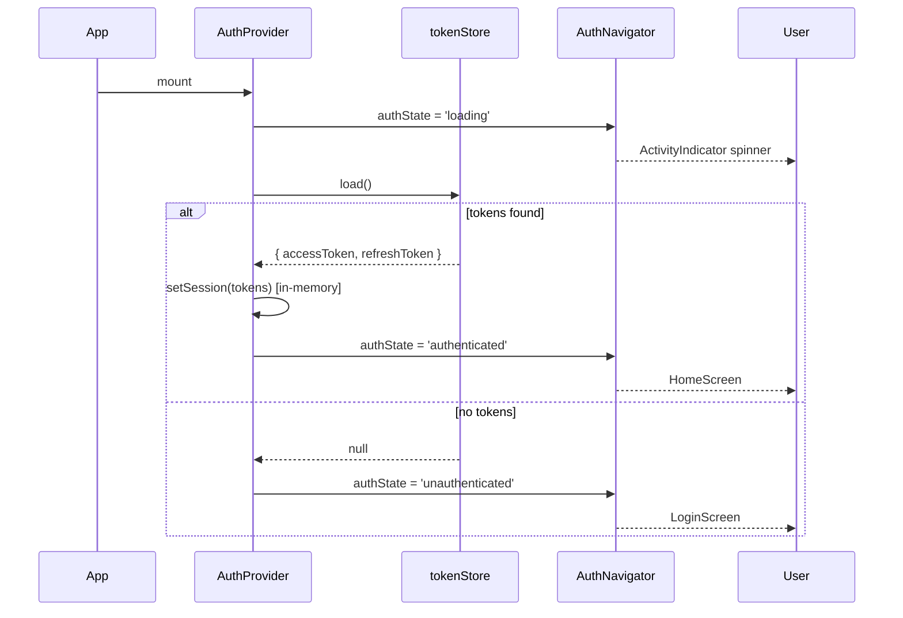
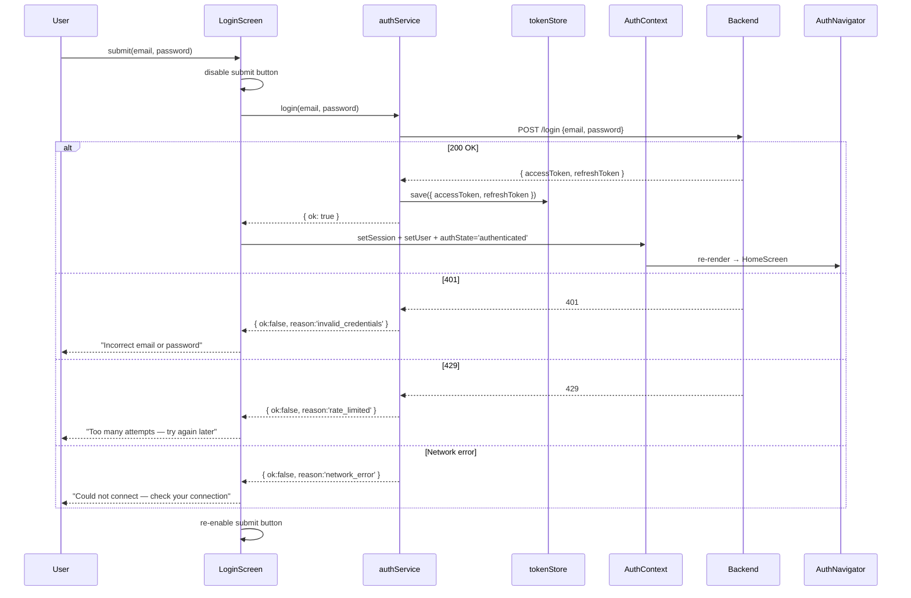
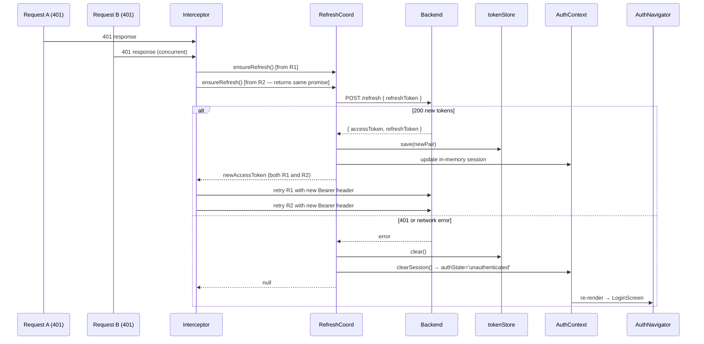

# Design Document — mobile-user-auth

## Overview

This feature adds a complete authentication layer to the veeder React Native app (0.86 + TypeScript). The app currently mounts `MediaShareScreen` directly from `App.tsx` with no login gate. This design introduces registration, login, persistent JWT session management, automatic token refresh, an authenticated home screen, and logout — all connected to the existing Node/Express backend running on port 3001.

The implementation is intentionally lightweight: no navigation library is added. Screen switching is driven by a React context `authState` value and conditional rendering in `AuthNavigator`. Two new npm packages are required (`axios` and `@react-native-async-storage/async-storage`). All auth logic lives under `src/auth/`; the three new screens live under `src/screens/`.

---

## Architecture

### 2.1 File / Module Layout

```
src/
  auth/
    config.ts              — BACKEND_URL constant + AsyncStorage key constants
    tokenStore.ts          — AsyncStorage read/write/clear (pure, no React)
    apiClient.ts           — axios instance + request/response interceptors
    refreshCoordinator.ts  — single-flight refresh promise
    authService.ts         — register / login / logout / getMe API wrappers
    AuthContext.tsx         — React context + AuthProvider + useAuth hook
    AuthNavigator.tsx       — conditional screen renderer driven by authState
  screens/
    LoginScreen.tsx        — email + password form; links to RegisterScreen
    RegisterScreen.tsx     — email + password form; links back to LoginScreen
    HomeScreen.tsx         — displays user email, MediaShare, sign-out button
```

### 2.2 Module Dependency Graph

```
App.tsx
  └── AuthNavigator.tsx
        ├── (loading)    ActivityIndicator
        ├── LoginScreen.tsx
        │     └── authService  ← apiClient ← refreshCoordinator
        ├── RegisterScreen.tsx
        │     └── authService
        └── HomeScreen.tsx
              └── authService (getMe, logout)

AuthContext.tsx
  ├── tokenStore.ts  ← config.ts
  ├── authService.ts ← apiClient.ts ← refreshCoordinator.ts ← tokenStore.ts
  └── (drives AuthNavigator via context value)
```

### 2.3 Entry-Point Change

`App.tsx` currently mounts `<MediaShareScreen />` directly. After this change it will mount `<AuthProvider><AuthNavigator /></AuthProvider>`. `MediaShareScreen` moves inside `HomeScreen` so existing functionality is preserved behind the auth gate.

---

## 3. New Dependencies

| Package | Pinned version | Purpose |
|---|---|---|
| `@react-native-async-storage/async-storage` | `2.1.2` | Persistent token storage across app restarts |
| `axios` | `1.7.7` | HTTP client with interceptor support |

Both packages must also be linked on Android/iOS. `@react-native-async-storage/async-storage` requires no additional native config on RN 0.86 (auto-linking covers it). `axios` is JS-only.

---

## Components and Interfaces

### 4.1 Shared Types (`src/auth/types.ts`)

```ts
/** The pair of tokens returned by login and refresh. */
export interface TokenPair {
  accessToken: string;
  refreshToken: string;
}

/** The authenticated user's profile from GET /me. */
export interface UserProfile {
  id: string;
  email: string;
}

/** The three possible auth states driving AuthNavigator rendering. */
export type AuthState = 'loading' | 'authenticated' | 'unauthenticated';
```

### 4.2 AuthContextValue (`src/auth/AuthContext.tsx`)

```ts
export interface AuthContextValue {
  /** Null while loading or when unauthenticated. */
  user: UserProfile | null;
  /** Current auth state; drives AuthNavigator. */
  authState: AuthState;
  /**
   * Attempts login. Stores tokens and fetches /me on success.
   * Never throws — all failures are encoded in the return value.
   */
  login(email: string, password: string): Promise<LoginResult>;
  /** Calls POST /logout (best-effort), then unconditionally clears session. */
  logout(): Promise<void>;
  /**
   * Transitions from 'unauthenticated' to 'unauthenticated' with the
   * LoginScreen showing. Used internally by the interceptor on session expiry.
   */
  clearSession(): void;
}
```

### 4.3 Result Types (`src/auth/types.ts`)

```ts
export type LoginResult =
  | { ok: true }
  | { ok: false; reason: 'invalid_credentials' | 'rate_limited' | 'network_error' };

export type RegisterResult =
  | { ok: true }
  | { ok: false; reason: 'already_exists' | 'invalid_input' | 'rate_limited' | 'network_error' };
```

### 4.4 tokenStore (`src/auth/tokenStore.ts`)

```ts
/**
 * Pure AsyncStorage wrapper. No React. No in-memory state.
 * All callers must await. Uses multiSet/multiRemove for atomicity.
 */
export interface TokenStore {
  /** Atomically persists both tokens to AsyncStorage. */
  save(pair: TokenPair): Promise<void>;
  /**
   * Returns the stored pair, or null if either token is missing.
   * Never throws — returns null on any storage error.
   */
  load(): Promise<TokenPair | null>;
  /** Atomically removes both tokens from AsyncStorage. */
  clear(): Promise<void>;
}
```

Storage keys are defined in `config.ts`:

```ts
export const ACCESS_TOKEN_KEY  = '@veeder/access_token';
export const REFRESH_TOKEN_KEY = '@veeder/refresh_token';
```

`save` uses `AsyncStorage.multiSet([[ACCESS_TOKEN_KEY, pair.accessToken], [REFRESH_TOKEN_KEY, pair.refreshToken]])` so both tokens are written in a single call. `clear` uses `AsyncStorage.multiRemove([ACCESS_TOKEN_KEY, REFRESH_TOKEN_KEY])` for the same atomicity guarantee.

### 4.5 authService (`src/auth/authService.ts`)

```ts
export interface AuthService {
  register(email: string, password: string): Promise<RegisterResult>;
  login(email: string, password: string): Promise<LoginResult>;
  /**
   * Best-effort server-side invalidation. Sends refreshToken in body.
   * Never throws — network/server failures are swallowed.
   */
  logout(refreshToken: string): Promise<void>;
  /**
   * Fetches the authenticated user profile.
   * Returns null when the API returns 401 (session expired / cleared by interceptor).
   */
  getMe(): Promise<UserProfile | null>;
}
```

### 4.6 refreshCoordinator (`src/auth/refreshCoordinator.ts`)

```ts
export interface RefreshCoordinator {
  /**
   * Ensures exactly one POST /refresh is in-flight at any time.
   * Concurrent callers await the same promise.
   * Resolves with the new TokenPair on success, or null when the session
   * has ended (401 from /refresh, network error, or timeout).
   */
  ensureRefresh(): Promise<TokenPair | null>;
}
```

The coordinator is created once at module level and exported as a singleton. Its internal `inFlight` promise is cleared after settlement so a future 401 initiates a fresh refresh cycle.

---

## Data Flow Diagrams

### 5.1 App Startup



### 5.2 Login Flow



### 5.3 Auto-Refresh on 401 (Single-Flight)



---

## 6. Navigation State Machine

`AuthNavigator` contains no navigation library. It reads `authState` from `useAuth()` and performs conditional rendering. It also maintains a local `screen: 'login' | 'register'` state to toggle between the two unauthenticated screens.

```
┌─────────────────────────────────────────────────────┐
│                   AuthNavigator                      │
│                                                     │
│  authState = 'loading'                              │
│    └─► <ActivityIndicator />                        │
│                                                     │
│  authState = 'unauthenticated'                      │
│    screen = 'login'                                 │
│      └─► <LoginScreen onGoToRegister={...} />       │
│    screen = 'register'                              │
│      └─► <RegisterScreen onGoToLogin={...} />       │
│                                                     │
│  authState = 'authenticated'                        │
│    └─► <HomeScreen />                               │
└─────────────────────────────────────────────────────┘
```

State transitions:

| From | Event | To |
|---|---|---|
| `loading` | tokenStore loaded, tokens found | `authenticated` |
| `loading` | tokenStore loaded, no tokens | `unauthenticated` / `login` |
| `unauthenticated/login` | login success | `authenticated` |
| `unauthenticated/login` | "Go to Register" | `unauthenticated/register` |
| `unauthenticated/register` | register success | `unauthenticated/login` |
| `unauthenticated/register` | "Go to Login" | `unauthenticated/login` |
| `authenticated` | logout | `unauthenticated/login` |
| `authenticated` | interceptor session-end | `unauthenticated/login` |

**Invariant**: `HomeScreen` and `LoginScreen`/`RegisterScreen` are never mounted at the same time. Only one branch of the conditional is rendered.

---

## Data Models

### 7.1 Storage Mechanism

`@react-native-async-storage/async-storage` is used as the persistence layer. It survives app process restarts on both Android and iOS and requires no additional native keychain configuration, making it appropriate for JWT tokens that already expire (15 min / 30 days).

### 7.2 Keys

```ts
// src/auth/config.ts
export const ACCESS_TOKEN_KEY  = '@veeder/access_token';
export const REFRESH_TOKEN_KEY = '@veeder/refresh_token';
```

The `@veeder/` namespace prefix prevents collisions with any other packages that also use AsyncStorage.

### 7.3 Atomicity

| Operation | AsyncStorage call | Guarantee |
|---|---|---|
| `save(pair)` | `multiSet([[key1, v1], [key2, v2]])` | Both tokens written or neither |
| `clear()` | `multiRemove([key1, key2])` | Both tokens removed in one call |
| `load()` | `multiGet([key1, key2])` | Consistent point-in-time read |

`multiGet` returns an array of `[key, value | null]` tuples. `load()` returns `null` if either value is missing or falsy, preventing a state where only one token is present.

### 7.4 In-Memory Session

The `AuthProvider` keeps an in-memory session object `{ accessToken, refreshToken }` in a `useRef`. The request interceptor reads the access token from this ref, not from AsyncStorage, to avoid an async operation on every request. AsyncStorage is only consulted at startup (bootstrap) and written to on login/refresh/logout.

```
AsyncStorage  ←→  tokenStore  ←→  AuthProvider (useRef session)
                                        ↓
                               apiClient interceptors (read only)
```

---

## 8. API Client & Interceptors

### 8.1 Axios Instance (`src/auth/apiClient.ts`)

```ts
import axios from 'axios';
import { BACKEND_URL } from './config';

export const apiClient = axios.create({ baseURL: BACKEND_URL });
```

`BACKEND_URL` is a single exported constant in `config.ts`:

```ts
// src/auth/config.ts
export const BACKEND_URL = 'http://<VPS_IP>:3001';
```

Changing the target environment requires editing only this one line.

### 8.2 Request Interceptor

```ts
apiClient.interceptors.request.use((config) => {
  const token = sessionRef.current?.accessToken;
  if (token) {
    config.headers.set('Authorization', `Bearer ${token}`);
  }
  return config;
});
```

- Reads from the in-memory `sessionRef`, never from AsyncStorage.
- Sets the header only when a token is present (unauthenticated requests such as `/login` and `/register` go through without a header).
- The token value in the header is always exactly the value stored in `sessionRef`; no URL token is ever read or used.

### 8.3 Response Interceptor

```ts
apiClient.interceptors.response.use(
  (response) => response,
  async (error: AxiosError) => {
    const status = error.response?.status;
    const config = error.config as RetryableConfig;

    if (status === 401 && config) {
      const isAuthEndpoint =
        config.url?.endsWith('/login') ||
        config.url?.endsWith('/register') ||
        config.url?.endsWith('/refresh');

      // Do not attempt refresh on auth endpoints or already-retried requests.
      if (isAuthEndpoint || config._retried) {
        return Promise.reject(error);
      }

      config._retried = true;
      const newPair = await refreshCoordinator.ensureRefresh();

      if (newPair === null) {
        // Session ended — clearSession() already called inside refreshCoordinator.
        return Promise.reject(error);
      }

      config.headers.set('Authorization', `Bearer ${newPair.accessToken}`);
      return apiClient(config);   // retry exactly once
    }

    return Promise.reject(error);
  },
);
```

The `_retried` flag on the request config prevents infinite retry loops: a 401 on the retried request surfaces to the caller rather than attempting another refresh.

The refresh call inside `refreshCoordinator` uses a bare `axios.post` (not `apiClient`) so it bypasses these interceptors and cannot recurse.

### 8.4 Session-End Callback

`refreshCoordinator` is created with an `onSessionEnded` callback injected from `AuthContext`. When called, it invokes `clearSession()` which sets `authState = 'unauthenticated'`, clears the in-memory session ref, and calls `tokenStore.clear()`. `AuthNavigator` then re-renders to `LoginScreen`.

---

## Error Handling

### 9.1 LoginScreen

| Condition | User-facing message |
|---|---|
| 401 from POST /login | "Incorrect email or password." |
| 429 from POST /login | "Too many login attempts — please try again later." |
| Network error | "Could not connect. Check your connection and try again." |
| Empty email or password | Inline field validation: "Email is required." / "Password is required." (client-side, no request sent) |

### 9.2 RegisterScreen

| Condition | User-facing message |
|---|---|
| 409 from POST /register | "An account with this email already exists." |
| 400 from POST /register | "Invalid email or password format." |
| 429 from POST /register | "Too many attempts — please try again later." |
| Network error | "Could not connect. Check your connection and try again." |
| Empty email or password | Inline field validation (client-side, no request sent) |

### 9.3 HomeScreen

| Condition | Behaviour |
|---|---|
| GET /me returns 200 | Display `user.email` |
| GET /me returns 401 | Interceptor fires refresh flow; if session ends, navigates to LoginScreen |
| GET /me network error | Show inline error banner: "Could not load profile." with a retry button |
| POST /logout network error | Ignored — session is cleared locally regardless |

### 9.4 Global (Interceptor-Driven)

| Condition | Behaviour |
|---|---|
| 401 on any protected request | Interceptor attempts single-flight refresh before surfacing error to caller |
| POST /refresh returns 401 | Session ended — tokens cleared, navigate to LoginScreen |
| POST /refresh network error | Session ended — tokens cleared, navigate to LoginScreen |
| Retried request returns 401 | Session ended — tokens cleared, navigate to LoginScreen |

---

## Correctness Properties

The following properties are testable and must hold across all code paths. They are numbered for traceability to acceptance criteria.

### Property 1: Token store never retains partial pairs

**Statement**: After any call to `tokenStore.save(pair)`, both `accessToken` and `refreshToken` are present in AsyncStorage, or neither is. There is no state where one token exists without the other.

**Rationale**: `save` uses `multiSet` (atomic) and `load` returns `null` if either value is absent. If `multiSet` fails, neither token is written.

**Validates: Requirements 3.1, 3.4**

---

### Property 2: Logout always clears tokens regardless of server response

**Statement**: After `authService.logout()` completes, `tokenStore.load()` returns `null`, regardless of whether `POST /logout` returned a success, an error, or timed out.

**Rationale**: `logout` wraps the server call in `try/catch` and calls `tokenStore.clear()` unconditionally in the `finally` block (or after the `catch`).

**Validates: Requirements 6.2, 6.3**

---

### Property 3: Single-flight — N concurrent 401s trigger exactly 1 refresh call

**Statement**: If N requests simultaneously receive a 401 and all call `refreshCoordinator.ensureRefresh()`, exactly one `POST /refresh` network request is issued. All N callers resolve with the same result.

**Rationale**: `ensureRefresh` checks `inFlight !== null` before starting a new refresh. Concurrent callers return the same promise reference.

**Validates: Requirements 4.6**

---

### Property 4: Auto-refresh retries original request exactly once

**Statement**: When a non-auth request receives a 401 and the refresh succeeds, the original request is retried once and only once. If the retry also returns 401, no further refresh is attempted.

**Rationale**: The `_retried` flag is set on the config before the retry. A subsequent 401 on that config hits the `config._retried` guard and rejects immediately.

**Validates: Requirements 4.2, 4.3**

---

### Property 5: Register success always navigates to LoginScreen (never HomeScreen)

**Statement**: When `POST /register` returns 201, `AuthNavigator` transitions to `LoginScreen`, not `HomeScreen`. No tokens are stored.

**Rationale**: `authService.register` does not call `tokenStore.save`. On `{ ok: true }`, `RegisterScreen` calls `onGoToLogin()`, which sets the local `screen` state to `'login'`. `authState` remains `'unauthenticated'`.

**Validates: Requirements 1.3**

---

### Property 6: Login success always stores both tokens

**Statement**: When `POST /login` returns 200 with `{ accessToken, refreshToken }`, `tokenStore.save` is called with both values before `authState` transitions to `'authenticated'`.

**Rationale**: `authService.login` calls `tokenStore.save(pair)` and `await`s it before returning `{ ok: true }`. `AuthContext.login` only sets `authState = 'authenticated'` after `authService.login` resolves successfully.

**Validates: Requirements 2.3, 3.1**

---

### Property 7: 401 from POST /refresh always ends session

**Statement**: When `POST /refresh` returns a 401, the session is cleared (`tokenStore.clear()` is called, `authState = 'unauthenticated'`, in-memory session ref is nulled) regardless of how many requests are waiting.

**Rationale**: `refreshCoordinator` calls `onSessionEnded()` on any rejection from `performRefresh`, including a 401. `onSessionEnded` is wired to `AuthContext.clearSession()`.

**Validates: Requirements 4.4**

---

### Property 8: Auth navigator never shows HomeScreen and LoginScreen simultaneously

**Statement**: At any point in time, the React tree contains at most one of `<HomeScreen>`, `<LoginScreen>`, `<RegisterScreen>`. It is never possible for two of these to be mounted simultaneously.

**Rationale**: `AuthNavigator` uses a single `if / else if / else` conditional render on `authState`. There is no code path that renders two branches.

**Validates: Requirements 8.1**

---

### Property 9: Bearer header always carries the stored access token value

**Statement**: The `Authorization` header sent with any request is `Bearer <sessionRef.current.accessToken>` and is never set to any other token value (e.g. a URL parameter or a stale cache).

**Rationale**: The request interceptor reads exclusively from `sessionRef.current?.accessToken`. No other code path sets the Authorization header.

**Validates: Requirements 4.7**

---

### Property 10: Network error on login never stores tokens

**Statement**: When `POST /login` fails with a network error, `tokenStore.save` is never called, and `tokenStore.load()` returns the same value it held before the login attempt.

**Rationale**: `authService.login` only calls `tokenStore.save` inside the branch that processes a `200` response. A network error throws an AxiosError caught before that branch is reached.

**Validates: Requirements 2.6**

---

### Property 11: Loading state is shown before token store is read

**Statement**: `AuthNavigator` renders the loading spinner whenever `authState === 'loading'`, and `authState` is `'loading'` from the moment `AuthProvider` mounts until `tokenStore.load()` resolves. Users can never see `LoginScreen` or `HomeScreen` before the bootstrap read completes.

**Rationale**: `AuthProvider` initialises `authState` with the literal `'loading'` value in `useState`. It does not transition to `'authenticated'` or `'unauthenticated'` until the async `bootstrap()` function inside `useEffect` completes.

**Validates: Requirements 8.4**

---

### Property 12: GET /me 401 clears session and navigates to LoginScreen

**Statement**: When `GET /me` returns a 401 and the subsequent refresh also fails (or returns 401), the session is cleared and `AuthNavigator` renders `LoginScreen`. The `HomeScreen` is unmounted.

**Rationale**: The 401 from `GET /me` is intercepted by the response interceptor. `refreshCoordinator.ensureRefresh()` is called. On failure, `onSessionEnded()` fires `AuthContext.clearSession()`, setting `authState = 'unauthenticated'`. `AuthNavigator` re-renders to `LoginScreen`.

**Validates: Requirements 4.4, 5.5**

---

## 11. Requirements Traceability

| Requirement | Design Component(s) |
|---|---|
| **Req 1 — User Registration** | `RegisterScreen.tsx`, `authService.register()`, `AuthNavigator` (→ LoginScreen on 201) |
| Req 1.1 — Form fields | `RegisterScreen.tsx` UI |
| Req 1.2 — Calls POST /register | `authService.register()` via `apiClient` |
| Req 1.3 — 201 → LoginScreen | `RegisterScreen` calls `onGoToLogin()`; `authState` stays `'unauthenticated'`; `screen` → `'login'` |
| Req 1.4 — 409 message | `RegisterScreen` maps `reason:'already_exists'` to UI string |
| Req 1.5 — 400 message | `RegisterScreen` maps `reason:'invalid_input'` to UI string |
| Req 1.6 — 429 message | `RegisterScreen` maps `reason:'rate_limited'` to UI string |
| Req 1.7 — Network error message | `RegisterScreen` maps `reason:'network_error'` to UI string |
| Req 1.8 — Disable button during request | `RegisterScreen` local `loading` state gates the submit button |
| Req 1.9 — Link to LoginScreen | `RegisterScreen` `onGoToLogin` prop → `AuthNavigator` local state |
| **Req 2 — User Login** | `LoginScreen.tsx`, `authService.login()`, `AuthContext.login()`, `tokenStore.save()` |
| Req 2.1 — Form fields | `LoginScreen.tsx` UI |
| Req 2.2 — Calls POST /login | `authService.login()` via `apiClient` |
| Req 2.3 — 200 → store tokens → HomeScreen | `AuthContext.login()`: `tokenStore.save()` then `authState='authenticated'` |
| Req 2.4 — 401 message | `LoginScreen` maps `reason:'invalid_credentials'` to UI string |
| Req 2.5 — 429 message | `LoginScreen` maps `reason:'rate_limited'` to UI string |
| Req 2.6 — Network error message | `LoginScreen` maps `reason:'network_error'` to UI string |
| Req 2.7 — Disable button during request | `LoginScreen` local `loading` state gates the submit button |
| Req 2.8 — Link to RegisterScreen | `LoginScreen` `onGoToRegister` prop → `AuthNavigator` local state |
| **Req 3 — Persistent Session** | `tokenStore.ts`, `AuthContext` bootstrap in `useEffect` |
| Req 3.1 — Persist both tokens | `tokenStore.save()` via `AsyncStorage.multiSet` |
| Req 3.2 — Tokens found → HomeScreen | `AuthProvider` bootstrap: `authState='authenticated'` |
| Req 3.3 — No tokens → LoginScreen | `AuthProvider` bootstrap: `authState='unauthenticated'` |
| Req 3.4 — Clear on logout/expiry | `tokenStore.clear()` via `AsyncStorage.multiRemove`; called by `clearSession()` |
| Req 3.5 — Survives app restart | `AsyncStorage` persistence across process restarts |
| **Req 4 — Auto Token Refresh** | `refreshCoordinator.ts`, `apiClient.ts` response interceptor |
| Req 4.1 — 401 → POST /refresh | Response interceptor detects 401 on non-auth endpoints |
| Req 4.2 — Refresh success → retry once | Interceptor sets `_retried=true`, retries with new token |
| Req 4.3 — Retry 401 → end session | `_retried` guard prevents loop; `onSessionEnded()` called |
| Req 4.4 — Refresh 401 → end session | `refreshCoordinator` calls `onSessionEnded()` on rejection |
| Req 4.5 — Refresh network error → end session | `refreshCoordinator` catches rejection, calls `onSessionEnded()` |
| Req 4.6 — Single-flight refresh | `refreshCoordinator.inFlight` deduplication |
| Req 4.7 — Bearer header only | Request interceptor sets header; never reads URL params |
| **Req 5 — Authenticated Home Screen** | `HomeScreen.tsx`, `authService.getMe()` |
| Req 5.1 — Calls GET /me on mount | `HomeScreen` `useEffect` calls `authService.getMe()` |
| Req 5.2 — Display email | `HomeScreen` renders `user.email` from `/me` response |
| Req 5.3 — MediaShare feature | `HomeScreen` mounts `<MediaShareScreen />` |
| Req 5.4 — Sign-out button | `HomeScreen` renders button wired to `AuthContext.logout()` |
| Req 5.5 — GET /me 401 → LoginScreen | Interceptor + `clearSession()` transitions `authState` |
| **Req 6 — Logout** | `AuthContext.logout()`, `authService.logout()`, `tokenStore.clear()` |
| Req 6.1 — Calls POST /logout with refreshToken | `authService.logout(refreshToken)` via bare axios post |
| Req 6.2 — Always clear session | `clearSession()` called in `finally` block regardless of server response |
| Req 6.3 — No tokens after logout | `tokenStore.clear()` inside `clearSession()` |
| **Req 7 — Backend URL Config** | `src/auth/config.ts` — single `BACKEND_URL` export |
| Req 7.1 — Single constant | `config.ts` exports `BACKEND_URL`; imported by `apiClient.ts` and `refreshCoordinator` |
| Req 7.2 — Base for all requests | `axios.create({ baseURL: BACKEND_URL })` in `apiClient.ts` |
| **Req 8 — In-App Navigation** | `AuthNavigator.tsx`, `AuthContext` `authState` |
| Req 8.1 — Exactly one screen at a time | Single `if/else if/else` conditional render in `AuthNavigator` |
| Req 8.2 — Valid session → HomeScreen | `authState='authenticated'` branch |
| Req 8.3 — No session → LoginScreen | `authState='unauthenticated'` branch |
| Req 8.4 — Loading indicator until bootstrap | `authState='loading'` initial state → `<ActivityIndicator>` branch |

---

## Testing Strategy

### 12.1 In-Memory Session Reference

`AuthProvider` stores the current token pair in a `useRef<TokenPair | null>`. React refs are synchronous and do not trigger re-renders, making them suitable for the request interceptor's hot path. `authState` (a `useState` value) handles re-renders independently.

### 12.2 Circular Dependency Avoidance

`apiClient.ts` must call `clearSession()` from `AuthContext` when a session ends, but `AuthContext` imports `apiClient`. To break this cycle, `apiClient.ts` exports a `setSessionEndedCallback(fn: () => void)` setter. `AuthContext` calls this setter during its `useEffect` bootstrap, injecting the `clearSession` function without creating a circular import at module load time.

### 12.3 React Native Compatibility

`axios` runs on React Native without modification (it uses the `XMLHttpRequest` adapter built into the RN runtime). `@react-native-async-storage/async-storage` 2.x supports RN 0.71+ with no extra native configuration beyond auto-linking.

### 12.4 TypeScript Strict Mode

All new files compile with the existing `strict: true` tsconfig. No `any` types are used in public interfaces. `AxiosError` generics are used where applicable.

### 12.5 Testing Surface

Each module in `src/auth/` is designed to be independently testable:
- `tokenStore` — mock `AsyncStorage` with `@react-native-async-storage/async-storage/jest/setup`
- `refreshCoordinator` — fully injectable deps (no real network or timers needed)
- `authService` — mock `apiClient` with `jest.mock`
- `AuthContext` — `@testing-library/react-native` with a custom wrapper
- `AuthNavigator` — render and assert on visible screen based on `authState`
