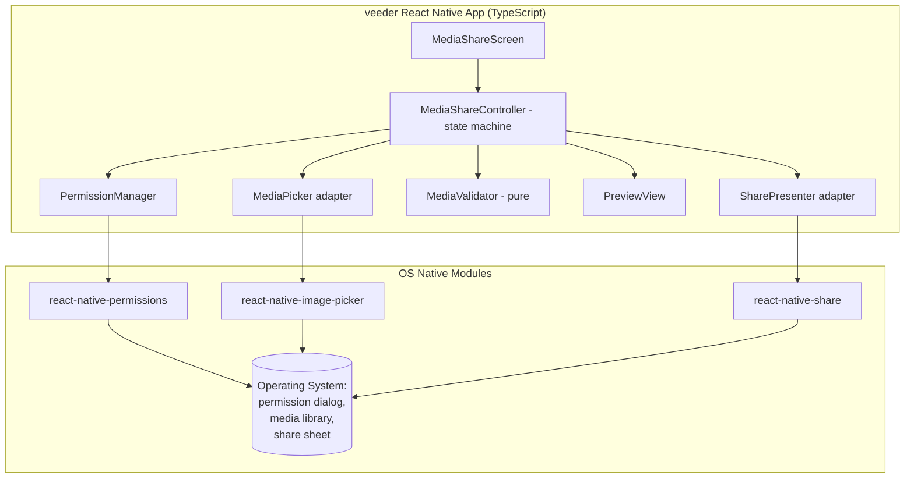
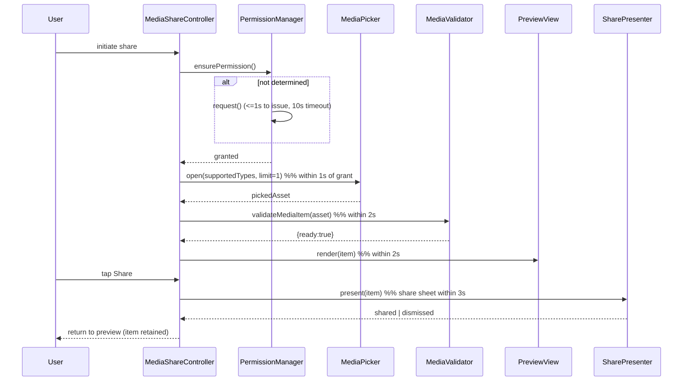
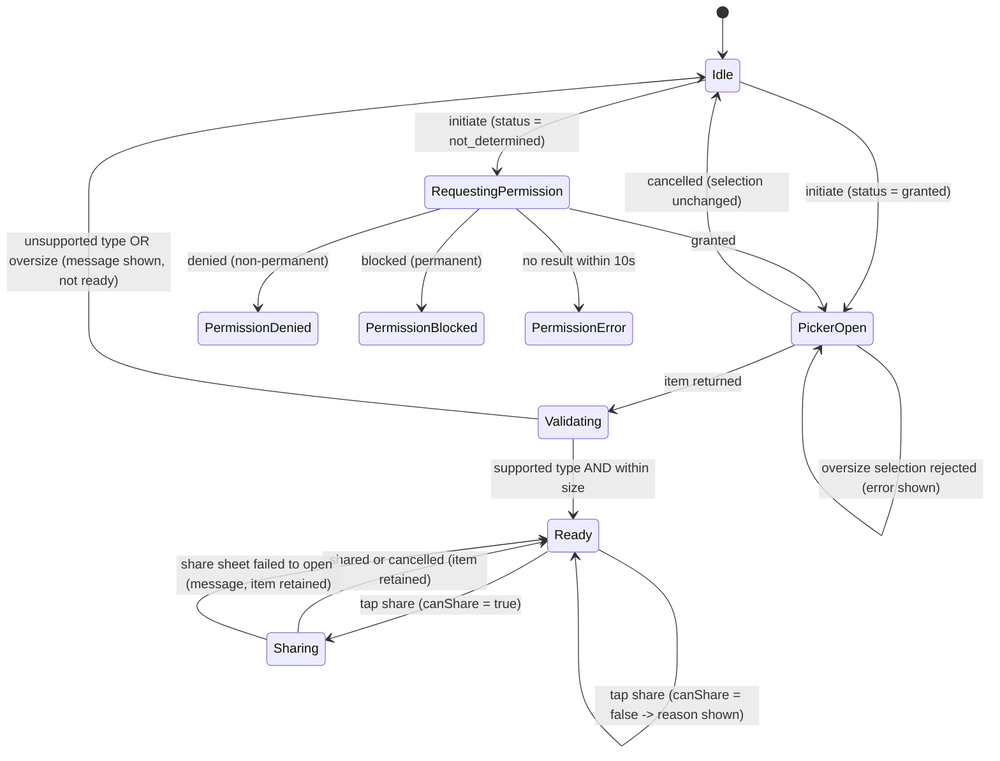

# Design Document

## Overview

Simple Media Share adds a self-contained media-sharing flow to the existing `veeder` React Native application (React Native 0.86, TypeScript, targeting Android/Kotlin and iOS/Swift). The User taps a share entry point, the app requests media-library permission if needed, presents the device media library, lets the User pick a single image or video, validates the selection (supported type and 100 MB size limit), previews it, and hands it to the operating system's native share sheet.

The feature is **client-only**. There is no backend, database, or network service. All logic runs on-device and is organized so the parts that carry real decision-making — permission-state resolution, media validation, and share eligibility — are **pure functions** independent of the native modules. This separation keeps the native, OS-controlled surfaces (the permission dialog, the media picker, the share sheet) thin and mockable, and concentrates testable behavior in pure TypeScript.

### Scope

In scope: requesting media permission, picking one media item, validating type/size, previewing, and invoking the native share sheet, plus clear feedback for denials, unsupported/oversized files, preview failures, and share cancellation.

Out of scope: editing/transcoding media, multi-item selection, uploading to any server, and authentication.

### Technology Decisions

| Concern | Decision | Rationale |
|---|---|---|
| App framework | Existing `veeder` React Native 0.86 + TypeScript | Requirements fix the feature to the existing app. |
| Permission handling | [`react-native-permissions`](https://github.com/zoontek/react-native-permissions) | Provides a unified, cross-platform status model (`granted`, `denied`, `blocked`, `unavailable`, `limited`) and `request`/`check` APIs that map cleanly to the six permission acceptance criteria. |
| Media selection | [`react-native-image-picker`](https://github.com/react-native-image-picker/react-native-image-picker) | Launches the platform media library, supports `mediaType` filtering and single selection (`selectionLimit: 1`), and returns URI, MIME type, file name, and file size for each asset. |
| Native sharing | [`react-native-share`](https://github.com/react-native-share/react-native-share) | The built-in RN `Share` API is limited to text/URLs; `react-native-share` reliably attaches a file URL and opens the OS share sheet on both platforms, and reports success/dismissal. |

Note: recent Android media policy favors the system photo picker for infrequent access. `react-native-image-picker` uses the system picker on modern Android, which can reduce the breadth of the permission prompt; the permission-state model below is designed to handle the case where a full grant is not required (`unavailable`/`limited` treated per the rules in Requirement 1). Content was rephrased for compliance with licensing restrictions. [Android photo picker guidance](http://facebook.stackoverflow.com/questions/78541426/react-native-image-picker-complain-with-new-google-media-policy)

### Key Design Decisions and Rationale

- **Pure decision core, thin native shell.** Three pure functions carry the feature's logic: `resolvePermissionOutcome(status)`, `validateMediaItem(item)`, and `canShare(item)`. Native modules only produce inputs (a permission status, a picked asset) and perform effects (open picker, open share sheet). This makes the decision logic deterministic and property-testable without a device.
- **Single validation function is the one source of truth.** The same `validateMediaItem` result drives whether an item is marked "ready to share" (Requirement 3) and whether the share action may proceed (Requirement 5.5). There is no second, divergent check that could disagree.
- **Type-error precedence over size-error.** When a file is both an unsupported type and oversized, the type message is shown and the size message is suppressed (Requirement 3.5). Validation returns an ordered, single primary reason rather than a set, so the UI never shows conflicting messages.
- **State machine drives the flow.** A finite set of states (`Idle → RequestingPermission → PermissionDenied/PermissionBlocked/PermissionError → PickerOpen → Validating → Ready → Sharing → Idle`) makes the "within N seconds" and "return to previous state" criteria explicit and testable as transitions.
- **Preview failures never block sharing.** A preview that cannot be generated falls back to a placeholder and keeps the share control enabled (Requirement 4.3); preview is presentation only and is decoupled from share eligibility.

## Architecture



The `MediaShareController` orchestrates the flow and owns the state machine. Adapters (`PermissionManager`, `MediaPicker`, `SharePresenter`) wrap the native libraries behind narrow interfaces so they can be mocked in tests. `MediaValidator` is a dependency-free pure module.

### Flow: happy path



### Flow: permission and validation branches



## Components and Interfaces

Types are illustrative TypeScript contracts the implementation must satisfy.

```typescript
// ---- Domain types ----
type SupportedMediaType =
  | 'image/jpeg' | 'image/png' | 'image/gif'
  | 'video/mp4' | 'video/quicktime';

const SUPPORTED_TYPES: readonly string[] = [
  'image/jpeg', 'image/png', 'image/gif', 'video/mp4', 'video/quicktime',
];

const MAX_FILE_SIZE_BYTES = 100 * 1024 * 1024; // 100 MB (Maximum_File_Size)
const FILE_NAME_MAX_CHARS = 40;

interface MediaItem {
  uri: string;
  mimeType: string;   // may be any string until validated
  sizeBytes: number;  // >= 0
  fileName: string;
}

// ---- Permission model ----
type PermissionStatus =
  | 'not_determined'  // never asked -> should request
  | 'granted'         // proceed to picker
  | 'denied'          // non-permanent denial -> "access required" message
  | 'blocked'         // permanently denied -> "enable in settings" message
  | 'error';          // request timed out / failed -> "could not obtain" message

type PermissionOutcome =
  | { action: 'open_picker' }
  | { action: 'show_message'; kind: 'access_required' | 'open_settings' | 'unavailable' };

interface PermissionManager {
  // Pure: maps a resolved status to the required outcome (Req 1.2-1.6).
  resolvePermissionOutcome(status: PermissionStatus): PermissionOutcome;
  // Effectful: checks current status, requesting only when not determined,
  // issuing the request within 1s and enforcing a 10s timeout (Req 1.1, 1.4, 1.6).
  ensurePermission(): Promise<PermissionStatus>;
}

// ---- Validation model ----
type ValidationResult =
  | { ready: true }
  | { ready: false; reason: 'unsupported_type' | 'exceeds_size'; message: string };

interface MediaValidator {
  // Pure. Type is checked first so type precedence beats size (Req 3.5).
  validateMediaItem(item: MediaItem): ValidationResult;
  // Pure. True iff validateMediaItem(item).ready is true (Req 5.5).
  canShare(item: MediaItem): boolean;
}

// ---- Picker adapter ----
type PickResult =
  | { kind: 'selected'; item: MediaItem }
  | { kind: 'cancelled' }
  | { kind: 'empty' }                       // no supported items available (Req 2.6)
  | { kind: 'rejected_oversize'; item: MediaItem }; // picker-level size reject (Req 2.5)

interface MediaPicker {
  // Opens the native library filtered to supported types, single selection (Req 2.1, 2.4).
  open(): Promise<PickResult>;
}

// ---- Preview ----
type PreviewModel =
  | { kind: 'image'; uri: string; displayName: string }
  | { kind: 'video'; frameUri: string; displayName: string; showPlayIndicator: true }
  | { kind: 'unavailable'; displayName: string }; // placeholder, share still enabled (Req 4.3)

interface PreviewBuilder {
  // Pure name handling: truncates names longer than 40 chars with an indicator (Req 4.4).
  truncateFileName(name: string): { text: string; truncated: boolean };
  build(item: MediaItem): Promise<PreviewModel>; // 2s budget, falls back to 'unavailable'
}

// ---- Share adapter ----
type ShareResult = 'shared' | 'dismissed' | 'failed';

interface SharePresenter {
  // Opens the OS share sheet with the item attached (Req 5.1-5.2).
  present(item: MediaItem): Promise<ShareResult>;
}
```

### Component responsibilities

- **MediaShareScreen** — the entry-point UI: a share trigger, the preview area, the file-name label, the share control, and inline message/error banners. Reflects controller state.
- **MediaShareController** — owns the state machine, sequences permission → pick → validate → preview → share, enforces the timing budgets, and returns to prior states on cancellation/failure.
- **PermissionManager** — wraps `react-native-permissions`; `ensurePermission` checks status, requests only when undetermined, and applies a 10s timeout mapping to `error`; `resolvePermissionOutcome` is the pure decision table.
- **MediaPicker** — wraps `react-native-image-picker`, configured with `mediaType` covering images and videos, `selectionLimit: 1`, and normalizes the native asset into a `MediaItem`; classifies cancellation, empty library, and oversize.
- **MediaValidator** — pure type/size checks and the `canShare` gate.
- **PreviewBuilder / PreviewView** — builds the image thumbnail or video first-frame-with-play-indicator, applies the 2s budget and placeholder fallback, and truncates the file name.
- **SharePresenter** — wraps `react-native-share`, attaches the file URL, and reports shared/dismissed/failed.

## Data Models

The feature holds only transient, in-memory state; nothing is persisted.

### MediaItem

| Field | Type | Notes |
|---|---|---|
| `uri` | string | Platform file/content URI of the picked asset. |
| `mimeType` | string | Reported MIME type; validated against `SUPPORTED_TYPES`. |
| `sizeBytes` | number | Non-negative byte count; compared to `MAX_FILE_SIZE_BYTES`. |
| `fileName` | string | Display name; truncated for presentation beyond 40 chars. |

### Controller state

```typescript
type ShareState =
  | { name: 'Idle' }
  | { name: 'RequestingPermission' }
  | { name: 'PermissionDenied' }     // access-required message
  | { name: 'PermissionBlocked' }    // open-settings message
  | { name: 'PermissionError' }      // could-not-obtain message
  | { name: 'PickerOpen' }
  | { name: 'Validating'; item: MediaItem }
  | { name: 'Ready'; item: MediaItem; preview: PreviewModel }
  | { name: 'Sharing'; item: MediaItem };
```

### Constants

- `SUPPORTED_TYPES` = `image/jpeg`, `image/png`, `image/gif`, `video/mp4`, `video/quicktime` (Supported_Media_Type).
- `MAX_FILE_SIZE_BYTES` = `104857600` (100 MB, Maximum_File_Size).
- `FILE_NAME_MAX_CHARS` = `40`.

## Correctness Properties

*A property is a characteristic or behavior that should hold true across all valid executions of a system — essentially, a formal statement about what the system should do. Properties serve as the bridge between human-readable specifications and machine-verifiable correctness guarantees.*

The properties below were derived from the prework classification of every acceptance criterion. This feature is well suited to property-based testing because its decision core — permission-outcome resolution, media validation with type/size precedence, the share-eligibility gate, and file-name truncation — is a set of pure functions whose behavior varies meaningfully across a large input space. UI rendering (thumbnails, banners), native picker/share-sheet invocation, and the timing budgets are verified with example, edge-case, and integration tests instead. Redundant criteria were consolidated: the six permission criteria collapse into one decision-table property; the validation criteria (3.1–3.5) collapse into one classification-with-precedence property; and the share-eligibility gate (5.5) reuses the same validation truth.

### Property 1: Permission status maps to the correct outcome

*For any* resolved `PermissionStatus`, `resolvePermissionOutcome` returns `open_picker` if and only if the status is `granted`; a `denied` status yields an access-required message, a `blocked` status yields an open-settings message, and an `error` status (including the 10-second timeout, treated as not granted) yields a could-not-obtain message. In every non-granted case the outcome never opens the picker.

**Validates: Requirements 1.2, 1.3, 1.5, 1.6**

### Property 2: A new request is issued only when permission is undetermined

*For any* initial permission status, `ensurePermission` issues an OS permission request if and only if the status is `not_determined`; when the status is already `granted` it resolves to `granted` without issuing a new request, and when already `denied` or `blocked` it resolves to that status without issuing a new request.

**Validates: Requirements 1.1, 1.4**

### Property 3: Media validation classifies type and size with type precedence

*For any* `MediaItem`, `validateMediaItem` returns `ready: true` if and only if the item's MIME type is in `SUPPORTED_TYPES` **and** its `sizeBytes` is within `MAX_FILE_SIZE_BYTES`; otherwise it returns `ready: false` with exactly one reason, and that reason is `unsupported_type` whenever the type is unsupported (regardless of size) and is `exceeds_size` only when the type is supported but the size exceeds the limit. The size message is never returned together with the type message.

**Validates: Requirements 3.1, 3.2, 3.3, 3.4, 3.5**

### Property 4: The share-eligibility gate agrees with validation

*For any* `MediaItem`, `canShare(item)` returns true if and only if `validateMediaItem(item).ready` is true; when it returns false the share sheet is not opened and the reason surfaced matches the validation reason for that item.

**Validates: Requirements 5.5**

### Property 5: Oversize selection is rejected while the picker state is retained

*For any* picked item whose size exceeds `MAX_FILE_SIZE_BYTES`, the selection is rejected, no item is marked ready to share, the flow remains in the picker-open state, and an over-size error is surfaced.

**Validates: Requirements 2.5**

### Property 6: File-name truncation preserves short names and marks long ones

*For any* file name, `truncateFileName` returns the original text unchanged with `truncated: false` when the name is at most 40 characters, and otherwise returns text whose visible length does not exceed the 40-character budget (including the truncation indicator) with `truncated: true`. The indicator is present exactly when the name was longer than 40 characters.

**Validates: Requirements 4.4**

### Property 7: Readiness transition matches validation result

*For any* result returned from the picker, the controller transitions to a state that marks the item ready to share if and only if an item was returned and `validateMediaItem` reports it ready; when no item is returned, or the item is not ready, no item is marked ready and the controller returns to its pre-selection (Idle) state.

**Validates: Requirements 2.2, 3.6, 4.5**

### Property 8: Cancellation and post-share return preserve selection state

*For any* controller state, closing the picker without a selection returns to the previous screen without changing the current selection; and *for any* item being shared, both a share-sheet cancellation and a share-sheet open failure return to the preview state with the same item still selected.

**Validates: Requirements 2.3, 5.3, 5.4**

## Error Handling

The feature surfaces a small set of typed, user-facing outcomes. All messages are non-blocking banners or inline text; none crash or clear a valid selection.

| Situation | Trigger | Behavior |
|---|---|---|
| Permission denied (non-permanent) | `resolvePermissionOutcome('denied')` | Show "media access is required to share media"; do not open picker (Req 1.3). |
| Permission blocked (permanent) | `resolvePermissionOutcome('blocked')` | Show "enable media access in device settings"; do not open picker (Req 1.5). |
| Permission request timeout/failure | No result within 10s → `error` | Treat as not granted; show "media access could not be obtained" (Req 1.6). |
| Empty library | Picker returns `empty` | Show empty-state "no shareable items available" (Req 2.6). |
| Oversize at picker | Picker returns `rejected_oversize` | Keep picker open; show over-size error (Req 2.5). |
| Unsupported type | `validateMediaItem` → `unsupported_type` | Show "file type is not supported"; not ready to share; suppress any size message (Req 3.2, 3.5). |
| Oversize (supported type) | `validateMediaItem` → `exceeds_size` | Show "file exceeds the 100 MB limit"; not ready to share (Req 3.3). |
| Preview generation failure/timeout | `build` cannot produce a preview within 2s | Show placeholder + "preview unavailable"; retain selection; keep share control enabled (Req 4.3). |
| Share sheet fails to open | `SharePresenter.present` → `failed` | Show "sharing is currently unavailable"; retain item selected (Req 5.4). |
| Share cancelled | `present` → `dismissed` | Return to preview with same item selected (Req 5.3). |
| Blocked share attempt | `canShare` false at share time | Do not open share sheet; show the reason the item cannot be shared (Req 5.5). |

Cross-cutting rules:

- **Fail-safe permissions.** Any ambiguous or failed permission resolution is treated as *not granted*; the picker is never opened on uncertainty (Req 1.6).
- **Preview is never a blocker.** A failed preview degrades to a placeholder and never disables the share control (Req 4.3).
- **A valid selection is sticky.** Cancellations and share failures never discard an already-validated selection (Req 5.3, 5.4).

## Testing Strategy

The decision core is pure and input-varying, so it is covered by property-based tests; the native surfaces and UI are covered by example, edge-case, and integration tests.

### Property-Based Tests

- **Library:** [`fast-check`](https://github.com/dubzzz/fast-check) with Jest (Jest is already configured in `package.json`). Property-based testing is **not** implemented from scratch.
- **Iterations:** each property test runs a minimum of 100 generated cases.
- **Tagging:** each property test carries a comment referencing its design property in the format:
  `// Feature: simple-media-share, Property {number}: {property_text}`
- **Isolation:** `PermissionManager`, `MediaPicker`, and `SharePresenter` are mocked so property runs stay on-device-free and cheap; generators cover supported and unsupported MIME types, sizes around the 100 MB boundary (0, just under, exactly at, just over), and file names around the 40-character boundary (including multi-byte characters).
- **Coverage:** Properties 1–8 above each map to a single property-based test.
  - Property 1, 2 → `resolvePermissionOutcome` / `ensurePermission` decision logic.
  - Property 3, 4 → `validateMediaItem` / `canShare` (rich MIME-type and size generators).
  - Property 5, 7, 8 → controller transitions with mocked adapters and a state-machine model.
  - Property 6 → `truncateFileName` string function.

### Example-Based Unit Tests

- Grant → picker opens (Req 1.2 happy path), image thumbnail rendering (Req 4.1), video first-frame + play-indicator rendering (Req 4.2), share control appears when ready (Req 4.5), and each specific error-banner message string.

### Edge-Case Tests

- Size boundaries: 0 bytes, exactly `MAX_FILE_SIZE_BYTES`, and one byte over, for both an image and a video type (Req 2.5, 3.3).
- File name exactly 40 characters vs 41 characters, and names containing emoji/combining characters (Req 4.4).
- Combined unsupported-type-and-oversize input to confirm type-message precedence (Req 3.5).

### Integration Tests

- End-to-end on a device/simulator with the real native modules for: permission request round-trip (Req 1.1), picker opens filtered to supported types and returns a single item (Req 2.1, 2.2, 2.4), share sheet opens with the file attached (Req 5.1, 5.2). Run with 1–3 representative cases, not property iterations.

### Smoke Tests

- App builds on Android and iOS with the three native modules linked, and the required media/photo permission strings are present in `AndroidManifest.xml` and `Info.plist`.

### UI Tests

- Snapshot tests for the preview area in image, video, and unavailable-placeholder states, and for the truncated file-name label rendering.
