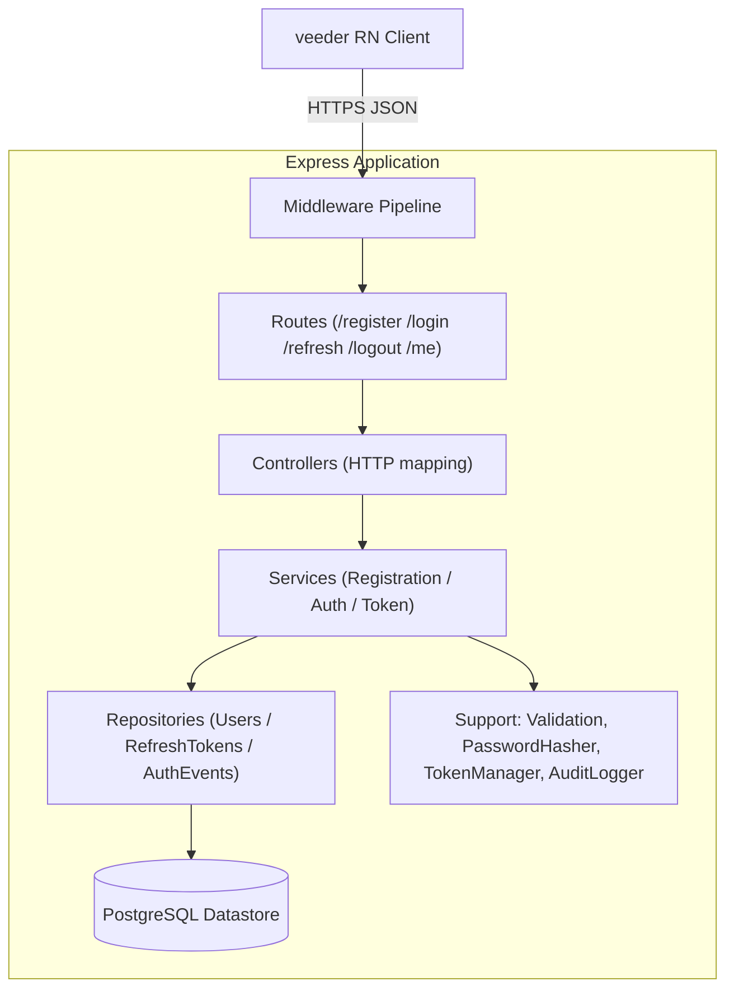
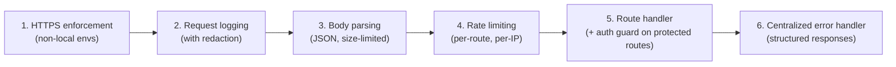
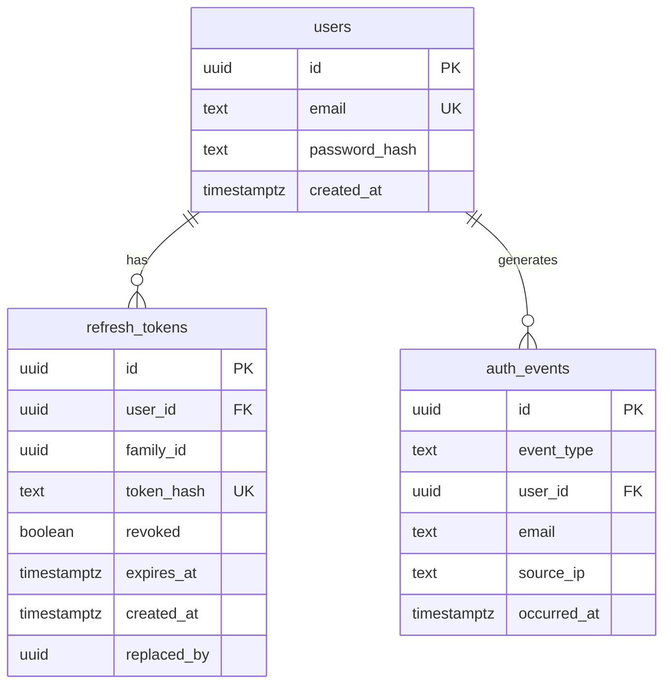

# Design Document

## Overview

The **user-registration-backend** is a Node.js + Express service written in TypeScript that provides
the server-side authentication foundation for the existing "veeder" React Native mobile app. It
exposes a small HTTP `Auth_API` (register, login, refresh, logout, get-current-user), persists state
to PostgreSQL, and enforces security fundamentals: password hashing, JWT access tokens with rotating
refresh tokens, rate limiting, HTTPS enforcement, structured error responses, and auth-event audit
logging.

This design realizes every requirement in `requirements.md`. Where the requirements demand a specific
constant (access token = 900s, refresh token = 2,592,000s, login limit = 10/60s, registration limit =
5/60s, signing key ≥ 32 chars, email ≤ 254 chars, password 8–128 chars), those constants are treated
as fixed contract values and centralized in a single configuration module.

### Repository Placement Decision

The backend is placed in a new **`server/` directory at the repository root**, as a sibling of the
existing React Native app package (which itself lives in `veeder/veeder/`). Rationale:

- **Separation of runtimes.** The mobile app is bundled by Metro/React Native and targets
  Android/iOS; the backend targets Node.js. They have incompatible `tsconfig`, dependency trees, and
  build tooling. Nesting the backend inside the RN package would pollute the Metro module graph and
  risk accidental bundling of server-only dependencies (e.g., `pg`, `bcrypt`) into the mobile bundle.
- **Independent lifecycle.** The backend has its own deploy target, migrations, and test suite. A
  dedicated directory keeps CI, linting, and versioning cleanly scoped.
- **Future multi-spec growth.** The admin dashboard (deferred spec) and analytics will also be
  server-side; `server/` gives them a natural home without further restructuring.

The `server/` package is self-contained (`server/package.json`, `server/tsconfig.json`) and does not
share a lockfile with the mobile app. It is documented as a sibling package rather than a formal
monorepo workspace to avoid imposing a workspace tool on the existing mobile project. If the team
later adopts npm/yarn/pnpm workspaces, `server/` can be promoted into that layout unchanged.

## Architecture

### Layered Structure

The service follows a strict **routes → controllers → services → repositories** layering. Each layer
depends only on the layer directly beneath it, which keeps HTTP concerns out of business logic and
business logic out of persistence.



### Middleware Pipeline (ordering matters)

Middleware executes in this order for every request; ordering is a security requirement, not an
implementation detail:



1. **HTTPS enforcement** runs first so non-HTTPS requests in non-local environments are rejected
   before any work, cost, or logging of body content occurs (Req 10.4).
2. **Request logging with redaction** captures method, path, status, source IP, and latency. It
   substitutes a fixed placeholder (`"[REDACTED]"`) for `password`, `accessToken`, and
   `refreshToken` fields anywhere in the logged payload (Req 10.5).
3. **Body parsing** uses `express.json()` with a small byte limit to bound abuse.
4. **Rate limiting** is applied per-route (login 10/60s, registration 5/60s) keyed by source IP
   before the handler runs (Req 8).
5. **Route handler** invokes the controller. Protected routes (`GET /me`) first run the
   **auth guard** middleware that verifies the access token.
6. **Centralized error handler** is the single place that converts thrown errors into the structured
   error body (Req 9). All controllers delegate error formatting here by throwing typed errors.

### Trusting the Source IP

Because the service runs behind a load balancer / TLS terminator in deployed environments, Express is
configured with `app.set('trust proxy', ...)` scoped to the known proxy hop count so `req.ip` reflects
the real client IP used for rate limiting and audit logging (Req 8, Req 11.2/11.3). The trust setting
is environment-driven and defaults to disabled locally.

### Environment Model

An `APP_ENV` value (`local` | `test` | `staging` | `production`) drives environment-dependent behavior:
HTTPS enforcement is **off** for `local`/`test` and **on** otherwise (Req 10.4). All other behavior is
environment-independent.

### Startup Validation

At boot, a configuration loader validates required environment values before the HTTP listener binds.
If `JWT_SIGNING_KEY` is absent or shorter than 32 characters, the process logs a startup error and
exits non-zero without ever serving traffic (Req 10.2). Database connectivity is also verified at
startup so the service fails fast on misconfiguration.

## Technology Decisions

| Concern | Choice | Rationale |
|---|---|---|
| HTTP framework | **Express 4** | Mature, minimal, ubiquitous middleware ecosystem; matches the "Node.js + Express" requirement directly. |
| Language | **TypeScript** (strict) | Required; static types make token/DTO contracts explicit and reduce a class of bugs. |
| DB access | **`pg` (node-postgres) + Knex query builder & migrations** | The schema is small and relational; `pg` gives full control over parameterized SQL (injection-safe) while **Knex** provides transactions, a query builder, and a first-class **migration** tool without the heavier abstraction/codegen of a full ORM. Prisma was considered but its generated client and migration engine add build complexity that outweighs the benefit for ~3 tables. |
| Migrations | **Knex migrations** | Ships with the chosen query builder; versioned, reversible, runnable in CI. |
| Password hashing | **argon2 (`argon2id`)** | Argon2id won the Password Hashing Competition and is the current OWASP first recommendation; memory-hardness resists GPU attacks better than bcrypt. bcrypt remains an accepted fallback per requirements; argon2 chosen for stronger defaults. |
| JWT | **`jsonwebtoken`** | Standard, well-audited; supports HS256 signing with an env-provided secret and explicit expiry. |
| Validation | **`zod`** | Declarative schemas produce typed parse results and structured issue lists that map cleanly to field-level validation errors (Req 9.4). |
| Rate limiting | **`express-rate-limit`** with a rolling-window store | Provides per-IP rolling windows and standard `Retry-After` / `RateLimit-*` headers. In-memory store for single-instance; a shared store (e.g., Redis) is the documented path for multi-instance deployments. |
| Logging | **`pino`** with a custom redaction serializer | Fast structured JSON logging; built-in redaction paths cover secret fields (Req 10.5). |
| Testing | **Jest** (runner/assertions), **supertest** (HTTP-level), **fast-check** (property-based) | Jest is the ecosystem default; supertest exercises the real Express app; fast-check drives the correctness properties. |

### Refresh Token Format and Hashing

A refresh token is an opaque high-entropy random string (≥ 256 bits from a CSPRNG), **not** a JWT.
Opaque tokens are trivially revocable and rotatable via the datastore, which the requirements demand
(rotation, reuse detection, family revocation). Only a one-way hash of the token is stored (Req 10.3);
the plaintext is returned to the client exactly once. Lookup is by hashing the presented token and
matching the stored hash.

To keep refresh-token verification a single indexed lookup, the stored hash is a **SHA-256** digest of
the token (fast, deterministic, indexable). This is appropriate because the token is already a
high-entropy random secret (unlike a low-entropy human password, which still requires argon2). The
access token is a signed JWT and is never persisted.

## Components and Interfaces

### Configuration (`config`)

Loads and validates environment values once at startup. Exposes typed constants:

```typescript
interface AppConfig {
  appEnv: 'local' | 'test' | 'staging' | 'production';
  httpsRequired: boolean;            // derived: false for local/test
  jwtSigningKey: string;             // validated length >= 32 at startup
  accessTokenTtlSeconds: 900;        // 15 minutes
  refreshTokenTtlSeconds: 2_592_000; // 30 days
  loginRateLimit: { max: 10; windowSeconds: 60 };
  registrationRateLimit: { max: 5; windowSeconds: 60 };
  database: { connectionString: string };
  trustProxyHops: number;
}

// Throws and aborts startup if JWT_SIGNING_KEY missing or < 32 chars (Req 10.2)
function loadConfig(env: NodeJS.ProcessEnv): AppConfig;
```

### Validation_Component (`validation`)

Zod schemas produce a normalized value or a structured error list.

```typescript
interface FieldError { field: string; reason: string; } // Req 9.4

type ValidationResult<T> =
  | { ok: true; value: T }
  | { ok: false; errors: FieldError[] }; // one entry per failed field (Req 2.5, 9.4)

// Trims + lowercases email BEFORE uniqueness/persistence (Req 2.6)
function validateRegistration(body: unknown): ValidationResult<{ email: string; password: string }>;
function validateLogin(body: unknown): ValidationResult<{ email: string; password: string }>;
function validateRefresh(body: unknown): ValidationResult<{ refreshToken: string }>;
```

Registration rules (Req 1.1, 2.1–2.6): email non-empty after trim, ≤ 254 chars, exactly one `@`, at
least one `.` in the domain; password 8–128 chars inclusive; missing/empty/whitespace-only fields each
produce a field error. Normalization (trim + lowercase email) happens before uniqueness checks.

### Password_Hasher (`passwordHasher`)

```typescript
interface PasswordHasher {
  hash(plaintext: string): Promise<string>;              // argon2id (Req 1.2)
  verify(plaintext: string, storedHash: string): Promise<boolean>; // Req 3.1
}
```

### Token_Manager (`tokenManager`)

```typescript
interface AccessTokenClaims { sub: string; iat: number; exp: number; }

interface IssuedTokens { accessToken: string; refreshToken: string; }

interface TokenManager {
  issueAccessToken(userId: string, now: number): string;        // exp = now + 900 (Req 3.2, 4.1)
  verifyAccessToken(token: string, now: number):                // Req 6.1–6.5
    | { ok: true; userId: string }
    | { ok: false; reason: 'missing' | 'invalid' | 'expired' | 'malformed' };

  issueRefreshToken(userId: string, now: number): Promise<string>;   // persists hashed (Req 3.3, 10.3)
  rotateRefreshToken(presented: string, now: number): Promise<      // Req 4.2, 4.6
    | { ok: true; tokens: IssuedTokens }
    | { ok: false; reason: 'invalid' | 'reuse' }>;
  revokeRefreshToken(presented: string): Promise<void>;             // logout (Req 5.1)
}
```

Rotation semantics (Req 4.2, 4.6):
- A valid, unexpired, unrevoked refresh token is revoked and replaced by a newly issued token that
  shares the same **family id** and links to its predecessor.
- Presenting an already-revoked (previously rotated) token is **reuse**: the entire token **family**
  for that user's session is revoked, and the request returns 401.

### Services

- **Registration_Service** — validates, normalizes email, checks uniqueness, hashes password, inserts
  the user inside a transaction, writes a `registration` auth event, returns id + email (Req 1, 11.1).
- **Auth_Service** — verifies credentials, issues tokens, handles logout revocation, writes
  `login-success` / `login-failure` / `logout` auth events (Req 3, 5, 11.2–11.4).
- Token refresh is handled by `TokenManager.rotateRefreshToken` orchestrated by a thin refresh
  controller.

### Repositories

```typescript
interface UsersRepository {
  findByEmail(email: string): Promise<UserRecord | null>;
  insert(email: string, passwordHash: string, tx?: Tx): Promise<UserRecord>; // unique email
  findById(id: string): Promise<UserRecord | null>;
}

interface RefreshTokensRepository {
  insert(row: NewRefreshTokenRow, tx?: Tx): Promise<void>;   // stores tokenHash only (Req 10.3)
  findByHash(tokenHash: string): Promise<RefreshTokenRow | null>;
  revokeById(id: string, tx?: Tx): Promise<void>;
  revokeFamily(familyId: string, tx?: Tx): Promise<void>;    // reuse detection (Req 4.6)
}

interface AuthEventsRepository {
  insert(event: NewAuthEvent): Promise<void>; // retried up to 3x by Audit_Logger (Req 11.8)
}
```

### Audit_Logger (`auditLogger`)

Wraps `AuthEventsRepository.insert` with retry-up-to-3 and non-blocking failure semantics (Req 11.8).
It never includes password or token values (Req 11.6) and substitutes a placeholder IP when the
source IP is unknown (Req 11.5). It is invoked separately for each applicable trigger so multiple
events in one operation each get their own record (Req 11.7).

## Data Models

### Entity Overview



### SQL DDL

```sql
-- Users
CREATE TABLE users (
    id            UUID PRIMARY KEY DEFAULT gen_random_uuid(),
    email         TEXT NOT NULL,
    password_hash TEXT NOT NULL,               -- argon2id hash; plaintext never stored (Req 1.3)
    created_at    TIMESTAMPTZ NOT NULL DEFAULT now()
);
-- Normalized (trimmed+lowercased) email is unique (Req 1.5, 2.6)
CREATE UNIQUE INDEX users_email_unique ON users (email);

-- Refresh tokens (opaque, hashed, rotating with family tracking)
CREATE TABLE refresh_tokens (
    id           UUID PRIMARY KEY DEFAULT gen_random_uuid(),
    user_id      UUID NOT NULL REFERENCES users(id) ON DELETE CASCADE,
    family_id    UUID NOT NULL,                -- shared across a rotation chain (Req 4.6)
    token_hash   TEXT NOT NULL,                -- SHA-256 of opaque token; no plaintext (Req 10.3)
    revoked      BOOLEAN NOT NULL DEFAULT FALSE,
    expires_at   TIMESTAMPTZ NOT NULL,         -- created_at + 2,592,000s (Req 3.3, 4.2)
    created_at   TIMESTAMPTZ NOT NULL DEFAULT now(),
    replaced_by  UUID REFERENCES refresh_tokens(id) -- successor after rotation
);
CREATE UNIQUE INDEX refresh_tokens_hash_unique ON refresh_tokens (token_hash);
CREATE INDEX refresh_tokens_family_idx ON refresh_tokens (family_id);
CREATE INDEX refresh_tokens_user_idx ON refresh_tokens (user_id);

-- Auth events (audit log for future analytics; Req 11)
CREATE TABLE auth_events (
    id          UUID PRIMARY KEY DEFAULT gen_random_uuid(),
    event_type  TEXT NOT NULL
                CHECK (event_type IN ('registration','login-success','login-failure','logout')),
    user_id     UUID REFERENCES users(id) ON DELETE SET NULL, -- null for login-failure (unknown user)
    email       TEXT,                          -- present for login-failure (Req 11.3)
    source_ip   TEXT,                          -- placeholder when unknown (Req 11.5)
    occurred_at TIMESTAMPTZ NOT NULL DEFAULT now() -- stored in UTC (Req 11.1–11.4)
);
CREATE INDEX auth_events_type_time_idx ON auth_events (event_type, occurred_at);
CREATE INDEX auth_events_user_idx ON auth_events (user_id);
```

### DTOs / API Contracts

All timestamps are UTC. All error bodies share one shape (Req 9.1):

```typescript
interface ErrorBody {
  error: {
    code: string;                 // machine-readable, 1..64 chars
    message: string;              // human-readable, 1..500 chars
    fields?: FieldError[];        // present for validation errors (Req 9.4)
  };
}
```

#### Endpoint Contracts

| Endpoint | Auth | Request body | Success | Errors |
|---|---|---|---|---|
| `POST /register` | none | `{ email, password }` | `201 { id, email }` (Req 1.4, 1.6) | `400` validation (Req 1.7, 2.x), `409` duplicate (Req 1.5), `429` rate limit (Req 8.4), `500` persistence (Req 1.8) |
| `POST /login` | none | `{ email, password }` | `200 { accessToken, refreshToken }` (Req 3.1, 3.4) | `400` malformed (Req 3.6), `401` bad creds (Req 3.5), `429` (Req 8.2), `500` token persist fail (Req 3.7) |
| `POST /refresh` | none | `{ refreshToken }` | `200 { accessToken, refreshToken }` (Req 4.1–4.3) | `400` missing token (Req 4.5), `401` invalid/expired/revoked/reuse (Req 4.4, 4.6) |
| `POST /logout` | none | `{ refreshToken }` | `200 {}` always (Req 5.2, 5.3, 5.5) | none surfaced (always 200) |
| `GET /me` | access token | — | `200 { id, email }` (Req 7.1, 7.2) | `401` missing/invalid/expired/malformed (Req 6.2–6.5, 7.3, 7.4), `404` user gone (Req 7.5) |

The access token is supplied via the `Authorization: Bearer <token>` header. Response bodies never
include `password_hash` (Req 1.6, 7.2).

## Correctness Properties

*A property is a characteristic or behavior that should hold true across all valid executions of a
system — essentially, a formal statement about what the system should do. Properties serve as the
bridge between human-readable specifications and machine-verifiable correctness guarantees.*

These properties are derived from the acceptance criteria via the prework analysis. Each is
universally quantified and intended to be implemented as a single `fast-check` property test running
a minimum of 100 iterations. Redundant criteria have been consolidated (see notes on each property).

### Property 1: Valid registration creates a retrievable account

*For any* email that satisfies the format and length rules and *any* password of length 8–128, when
it is submitted to `POST /register`, the response is `201` with the account id and normalized email,
and a `User_Account` with that email is subsequently retrievable.

**Validates: Requirements 1.1, 1.4**

### Property 2: Passwords are stored only as a verifying hash

*For any* valid password, after registration the stored `password_hash` is not equal to the plaintext
password, no datastore column contains the plaintext, and `verify(plaintext, storedHash)` returns
true.

**Validates: Requirements 1.2, 1.3**

### Property 3: Hashed password is never present in responses

*For any* successful `POST /register` or `GET /me` response, the response body contains no
`password`, `passwordHash`, or `password_hash` field.

**Validates: Requirements 1.6, 7.2**

### Property 4: Validation reports exactly the fields that failed

*For any* registration payload that violates an arbitrary subset of the validation rules (email
format/length, password length, missing/empty/whitespace-only fields), the response is `400` and the
set of `error.fields[].field` entries equals exactly the set of fields that violated a rule, each with
a non-empty human-readable reason.

**Validates: Requirements 1.7, 2.1, 2.2, 2.3, 2.4, 2.5, 9.4**

### Property 5: Email normalization determines identity

*For any* email, registering it and then attempting to register a second email that differs only by
letter case or surrounding whitespace yields `409`, and the persisted email is the trimmed,
lowercased form.

**Validates: Requirements 2.6, 1.5**

### Property 6: Duplicate registration is rejected without disclosure

*For any* already-registered email, a subsequent registration with *any* password returns `409` with
a duplicate-account error whose body does not reveal whether a password matched.

**Validates: Requirements 1.5**

### Property 7: Successful login issues exactly one access and one refresh token

*For any* registered user authenticating with the correct password, `POST /login` returns `200` with
exactly one access token and exactly one refresh token, and exactly one refresh-token record is
persisted for that login.

**Validates: Requirements 3.1, 3.4**

### Property 8: Access token expiry is always issuance + 900s

*For any* issuance time, a freshly issued access token decodes to `exp - iat == 900`.

**Validates: Requirements 3.2, 4.1**

### Property 9: Refresh token expiry is issuance + 2,592,000s and persisted before return

*For any* issued refresh token, the persisted record has `expires_at == created_at + 2_592_000` and
the record exists in the datastore before the tokens are returned to the caller.

**Validates: Requirements 3.3**

### Property 10: Failed login is generic and issues no tokens

*For any* login attempt with an unknown email or an incorrect password, the response is `401` with a
generic message that does not indicate which field was wrong, and no access or refresh token is
issued or persisted.

**Validates: Requirements 3.5**

### Property 11: Malformed login is rejected before credential verification

*For any* login body in which email or password is missing, empty, or longer than 254 characters, the
response is `400` and the password hasher is never invoked.

**Validates: Requirements 3.6**

### Property 12: Refresh rotation revokes the old token and issues a valid successor

*For any* valid, unexpired, unrevoked refresh token, refreshing it returns `200` with a new access
token (`exp == now + 900`) and a new refresh token; the presented token becomes revoked, and the new
token is unrevoked, persisted, expires at `now + 2_592_000`, and shares the predecessor's family id.

**Validates: Requirements 4.1, 4.2, 4.3**

### Property 13: Invalid refresh tokens are rejected

*For any* refresh token that is absent from the datastore, expired, or revoked, `POST /refresh`
returns `401` and no new access or refresh token is issued. *For any* request with a missing or empty
`refreshToken` field, the response is `400`.

**Validates: Requirements 4.4, 4.5**

### Property 14: Reuse of a rotated refresh token revokes the entire family

*For any* rotation chain of arbitrary length, presenting a previously-rotated (revoked) token results
in `401`, and every refresh token in that family is revoked — including the most recently issued one,
which can no longer be refreshed.

**Validates: Requirements 4.6**

### Property 15: Logout revokes the active token and always returns 200

*For any* refresh token that is valid, already revoked, or absent/malformed, `POST /logout` returns
`200`; when the token was valid and active it becomes revoked in the datastore, and when it is
absent or malformed no revocation write is attempted.

**Validates: Requirements 5.1, 5.2, 5.3**

### Property 16: A revoked refresh token cannot be refreshed

*For any* refresh token, after it is revoked via logout, a subsequent `POST /refresh` presenting that
token returns `401` indicating the token is invalid or revoked.

**Validates: Requirements 5.4**

### Property 17: Access token guard classifies every token to exactly one outcome

*For any* inbound access token value on a protected endpoint, verification maps it to exactly one
outcome: a correctly signed, unexpired token is accepted and the request is processed for its user; a
missing token yields `401` authentication-required; a token with a bad/tampered signature yields
`401` invalid; a token with `exp <= now` yields `401` expired; an unparseable token yields `401`
malformed. In every failure case no `User_Account` resource is modified.

**Validates: Requirements 6.1, 6.2, 6.3, 6.4, 6.5, 7.3, 7.4**

### Property 18: Profile round-trip returns the caller's own account

*For any* registered user, calling `GET /me` with that user's valid access token returns `200` with
the same account id and normalized email produced at registration.

**Validates: Requirements 7.1**

### Property 19: Valid token for a deleted account returns 404

*For any* valid access token whose referenced `User_Account` no longer exists, `GET /me` returns
`404` with an account-not-found error.

**Validates: Requirements 7.5**

### Property 20: Rate limiting enforces the per-endpoint boundary

*For any* endpoint with limit `L` (login `L=10`, registration `L=5`) and *any* sequence of requests
from a single source IP within a 60-second window, the first `L` requests reach the handler and every
request beyond `L` returns `429` with an integer `Retry-After` header in `[1, 60]` and is not
processed as an authentication/registration attempt.

**Validates: Requirements 8.1, 8.2, 8.3, 8.4**

### Property 21: Every error response has a well-formed, safe body

*For any* request that produces an error response, the body contains a non-empty `error.code` of
length 1–64 and a non-empty `error.message` of length 1–500, and contains no stack trace or internal
implementation detail; unhandled internal errors surface as `500` under this same shape.

**Validates: Requirements 9.1, 9.2**

### Property 22: Signing-key length gate

*For any* candidate signing key string, `loadConfig` succeeds if and only if the key is present and at
least 32 characters long; for absent keys or keys shorter than 32 characters it aborts startup with a
signing-key error and the service does not enter a serving state.

**Validates: Requirements 10.2**

### Property 23: Refresh tokens are persisted only as a one-way hash

*For any* issued refresh token, the datastore stores `hash(token)` and never the plaintext token
value; the plaintext does not appear in any refresh-token column.

**Validates: Requirements 10.3**

### Property 24: HTTPS is enforced in non-local environments

*For any* inbound request in a non-local environment, a non-HTTPS request is rejected with a response
indicating HTTPS is required and is not processed, while an HTTPS request proceeds; in local/test
environments enforcement is not applied.

**Validates: Requirements 10.4**

### Property 25: Log output redacts secrets

*For any* request/response payload containing `password`, `accessToken`, or `refreshToken` values in
any position, the produced log output substitutes the fixed redaction placeholder and does not
contain the secret value.

**Validates: Requirements 10.5**

### Property 26: Auth events are recorded with the required fields

*For any* triggering operation, the corresponding `Auth_Event` is persisted with the correct type and
required fields and a UTC timestamp: `registration` (user id), `login-success` (user id, source IP),
`login-failure` (submitted email, source IP), `logout` (user id); when the source IP cannot be
determined a fixed placeholder is recorded.

**Validates: Requirements 11.1, 11.2, 11.3, 11.4, 11.5**

### Property 27: Persisted auth events contain no secrets

*For any* recorded `Auth_Event`, the persisted record contains no password value and no token value.

**Validates: Requirements 11.6**

### Property 28: One event per applicable trigger

*For any* single operation in which `N` distinct auth-event trigger conditions apply, exactly `N`
separate `Auth_Event` records are persisted.

**Validates: Requirements 11.7**

## Error Handling

### Principles

- **Single formatting authority.** Controllers and middleware throw typed errors; one centralized
  Express error handler converts them into the `ErrorBody` shape (Req 9.1). No handler formats error
  JSON on its own, which guarantees the shape invariant (Property 21).
- **Typed error taxonomy.** A small set of error classes carries an HTTP status and a stable machine
  `code`:

  | Error class | Status | `code` | Trigger |
  |---|---|---|---|
  | `ValidationError` | 400 | `validation_error` | Zod issues → `fields[]` (Req 2, 9.4) |
  | `AuthenticationError` | 401 | `authentication_failed` | bad login creds (Req 3.5) |
  | `TokenError` | 401 | `invalid_token` / `token_expired` / `token_malformed` / `auth_required` | token guard + refresh (Req 4, 6, 7) |
  | `ConflictError` | 409 | `duplicate_account` | duplicate email (Req 1.5) |
  | `NotFoundError` | 404 | `account_not_found` | user gone (Req 7.5) |
  | `RateLimitError` | 429 | `rate_limited` | limits exceeded (Req 8) |
  | `InternalError` (fallback) | 500 | `internal_error` | anything unhandled (Req 9.2) |

- **No leakage.** The error handler serializes only `code`, `message`, and (for validation)
  `fields`. Stack traces and internal details are logged server-side via `pino` but never returned
  (Req 9.2). Generic messages are used for authentication failures to avoid disclosure (Req 3.5, 1.5).

### Transactional Integrity

State-changing operations run inside a single database transaction (Knex `transaction`):

- **Registration** (Req 1.8, 9.3): user insert + `registration` auth event are attempted such that a
  persistence failure rolls back, leaving no partial user. If the datastore is unavailable the
  handler returns `500` and nothing is committed.
- **Login token issuance** (Req 3.7): the refresh-token record must be persisted before tokens are
  returned; a persistence failure returns `500` and returns no tokens.
- **Refresh rotation** (Req 4.2, 4.6): revoking the presented token and inserting the successor (or
  revoking a whole family on reuse) occur atomically so the token store never lands in a half-rotated
  state.

### Degrade-Gracefully Paths

- **Logout** never surfaces an error: invalid, revoked, absent, or write-failing cases all return
  `200`, and a failed revocation write leaves stored state unchanged (Req 5.2, 5.3, 5.5).
- **Auth-event writes** are non-blocking: the `Audit_Logger` retries a failed insert up to 3 times and
  then emits a non-blocking failure indication without interrupting the originating operation
  (Req 11.8). Audit logging is therefore best-effort and never fails a registration/login/logout.
- **Response formatting after commit** (Req 1.4): once a user is fully persisted, the endpoint returns
  `201` even if serializing the response body fails; the commit is authoritative.

## Testing Strategy

### Dual Approach

- **Property-based tests (fast-check)** verify the universal properties in the Correctness Properties
  section across many generated inputs. These carry the bulk of correctness coverage.
- **Example-based unit / integration tests (Jest + supertest)** cover specific scenarios, edge cases,
  fault-injection paths, and latency bounds that are not universal properties.

PBT is appropriate here because the core logic (validation, token issuance/rotation/reuse detection,
error shaping, rate-limit boundaries, redaction, normalization) consists of input-driven functions
whose behavior varies meaningfully across a large input space.

### Property Test Requirements

- Library: **fast-check** with **Jest**.
- Minimum **100 iterations** per property test.
- Each property test is tagged with a comment referencing its design property using the format:
  `// Feature: user-registration-backend, Property {number}: {property_text}`
- Each correctness property (1–28) is implemented by a **single** property-based test.
- Generators/arbitraries to build:
  - Valid emails (RFC-5322-ish addr-spec) and invalid emails (missing `@`, multiple `@`, no domain
    dot, > 254 chars, empty, whitespace-only).
  - Passwords across and around the 8/128 boundaries (lengths 0, 7, 8, 128, 129, > 129).
  - Case/whitespace email variants for normalization.
  - Arbitrary token strings: valid JWTs, wrong-key signatures, tampered payloads, `exp <= now`,
    non-JWT junk (for the token-guard classification property).
  - Refresh rotation chains of arbitrary length (for reuse/family revocation).
  - Request sequences for a single IP crossing rate-limit boundaries (`L` and `L+1`).
  - Payloads embedding secrets in nested positions (for redaction properties).

### Example / Integration Tests (non-PBT)

These cover the EDGE_CASE and non-universal criteria identified in prework:

- **Datastore failure during registration** → `500`, no partial user (Req 1.8, 9.3) via a repository
  mock that throws inside the transaction.
- **Refresh persistence failure at login** → `500`, no tokens (Req 3.7).
- **Logout revocation write failure** → state unchanged, `200` (Req 5.5).
- **Auth-event write failure** → exactly 3 retries then non-blocking indication; originating
  operation still succeeds (Req 11.8) — assert retry count via a mock.
- **Latency bounds** (Req 3.4, 4.3, 5.1, 7.1) → supertest timing assertions that login/refresh/logout
  and `/me` respond within 2 seconds under normal conditions.
- **Signing-key startup smoke** (Req 10.1) → the `TokenManager` reads the key from config/env, and
  the app aborts startup on a missing/short key (complements Property 22).
- **Full HTTP happy paths** for each endpoint via supertest against the real Express app, using a
  disposable test PostgreSQL database with migrations applied.

### Test Data / Environment

- Integration tests run against a real PostgreSQL instance (Docker or a CI service) with Knex
  migrations applied and truncated between tests for isolation.
- Pure-logic property tests (validation, token TTL math, config gate, redaction) run without a
  database by exercising the components directly, keeping 100+ iterations fast.
